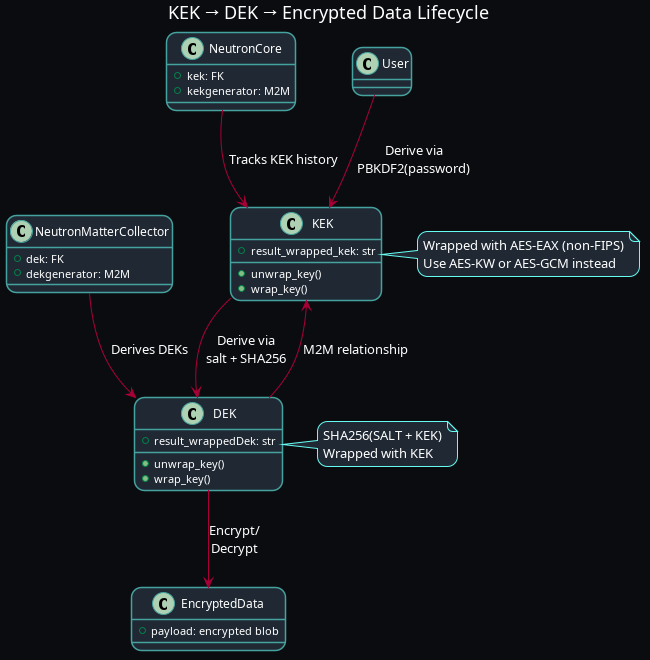

# Building a Django-Based Key Management System Aligned with NIST: From KEK/DEK to FIPS Compliance

> _“Crypto isn't secure until it's governed. This is the journey of turning best effort into best practice.”_

## Background: Inspired by NIST Enterprise Key Management Guidance

This implementation draws directly from key NIST publications:

- **NIST SP 800-57, Part 1 Rev. 5** – *Key Management Fundamentals*
- **NIST SP 800-130** – *Framework for Designing Key Management Systems (KMS)*
- **NIST SP 800-38F** – *Recommendation for Block Cipher Modes of Operation: Methods for Key Wrapping*
- **NIST SP 800-175B** – *Guidance on the Use of Key Management Systems (Enterprise Level)*

The system splits **Key Encryption Keys (KEKs)** from **Data Encryption Keys (DEKs)**, implements AES key wrapping, and supports dynamic key derivation from user credentials.

---

## System Design: NIST-Aligned Constructs

| Concept | Your Implementation | NIST Alignment |
|--------|---------------------|----------------|
| **Key Types** | KEK (user-derived), DEK (data-specific) | ✅ SP 800-57 key hierarchy |
| **Key Derivation** | PBKDF2 + SHA-256 | ✅ SP 800-132 compliant |
| **Key Wrapping** | AES-EAX with nonce | 🔶 Close, but not FIPS-approved |
| **Key Lifetimes** | `NeutronCore` for KEK history | ✅ Lifecycle per SP 800-57 |
| **Key Separation** | KEK ↔ DEK logical binding | ✅ Isolation best practice |
| **Key Erasure** | `secure_erase()` in memory | ✅ SP 800-88 zeroization support |

---

## Current System Capabilities

-  **Dynamic KEK derivation** from user passwords using SHA-256 & PBKDF2.
-  **DEK generation and wrapping** using key+salt+nonce.
-  **Key rotation support** via the `NeutronCore` model.
-  **Secure key erasure** post-wrapping/unwrapping to prevent leakage.
-  **Tracking provenance** via Django ORM relations.

---

##  Diagram: KEK and DEK Relationship

Below is a diagram of the KEK and DEK relationship from a software 
Design point of view

---

##  What’s Missing for FIPS 140-3 Compliance?

### 1.  Replace AES-EAX

- AES-EAX is not FIPS-approved.
-  Use **AES-KW** (Key Wrap) or **AES-GCM** (with deterministic IV if required).
-  Reference: [NIST SP 800-38F](https://nvlpubs.nist.gov/nistpubs/Legacy/SP/nistspecialpublication800-38f.pdf)

### 2.  Use a FIPS-Approved Crypto Provider

- The default `cryptography.hazmat` is not FIPS-certified.
- Options:
  - ✅ Build `pyca/cryptography` against **OpenSSL FIPS module**
  - ✅ Integrate a **hardware HSM** (e.g., AWS CloudHSM, YubiHSM)
  - ✅ Use **BoringSSL** with FIPS provider

### 3.  Key Lifecycle States

- Introduce lifecycle management:
  - `Pre-active`, `Active`, `Deactivated`, `Destroyed`
  - Implement via model enum or audit field

### 4.  Governance and Policy Documents

- Define and codify:
  - **Key Usage Policy**
  - **Access Control**
  - **Audit Logging**
  - **Key Rotation & Destruction**
  - **Incident Response**

### 5. Testing and Validation

- Add test vectors from NIST CAVP
- CI test suite for:
  - Wrap/unwrap verification
  - Format compliance
  - Memory zeroization checks

---

##  Next Steps to Achieve Compliance

| Step | Action |
|------|--------|
| **1** | Replace AES-EAX with AES-KW or AES-GCM |
| **2** | Compile OpenSSL with FIPS provider and rebuild cryptography |
| **3** | Introduce state transitions (`KeyState.ACTIVE`, etc.) |
| **4** | Add audit logs for all key material accesses |
| **5** | Write SP 800-130-compliant governance docs |
| **6** | Validate using FIPS CAVP test vectors |

---

##  Final Thoughts

> _“Most people implement crypto for security. Few implement it for governance. You can do both.”_

This system is a practical expression of the NIST KMS framework, written in Django and Python. With a few upgrades—algorithm selection, key lifecycle tracking, audit logging—you’ll have a FIPS-aligned, enterprise-grade Key Management System ready for wider deployment or compliance review.

---

_Originally implemented as `1337_TECH` POC, Austin TX © 2023_

