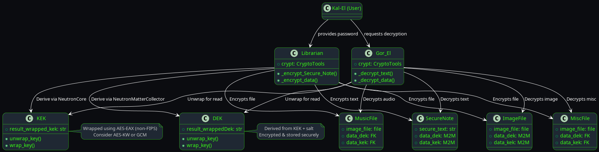

# Kryptonian Cryptography in Django: Practical Use of KEK/DEK Models for Securing Data at Rest

The Fortress of Solitude located in the Alaskan Arctic was the inspiration.  The aim was to 
provide a means of extremely strong encryption that would, in theory, and maybe practice, never be decrypted
so long the user never wanted to share the information.  This led me through a long, 3-4 years, of development over
the weekends.  My goal was always to provide a mechanism that was simple to use, thoroughly thought out, and applied to
a system that was extremely hard to crack. So I looked to nowhere else but NIST documentation.  
In order to translate and provide a useful piece of code that most Junior developers could understand, and not just Ph.D. level Jargon


> _“I was born free, I'll fight for freedom, and I'll die as a free man - American Parable, unknown”_
## Introduction

In [Blog Post #1](./05-03-2025_FortressOfSolitude_Encryption.md), we broke down the fundamentals of implementing a secure Key Encryption Key (KEK) and Data Encryption Key (DEK) system using Django models. Now, in **Blog Post #2**, we demonstrate how this cryptographic infrastructure is **actually deployed** in a Django app called `_FortressOfSolitude`.

You'll see how the KEK and DEK models are leveraged to encrypt and decrypt files and secure notes through two key manager classes: `Librarian` and `Gor_El`.

---

## Objective

- Encrypt arbitrary files and notes per object  
- Derive KEK/DEK pairs dynamically for each request  
- Use separate managers for encryption and decryption  
- Embed KEK/DEK references in Django models for data binding  
- Structure with FIPS-140-3 compliance goals  

---

## Overview Diagram


## The Librarian: Encrypting Files & Notes

The `Librarian` manager class performs:

- **Key derivation**: creates new KEKs and DEKs on the fly  
- **AES encryption**: currently using `AES-EAX`, upgradable to FIPS-compliant `AES-GCM`  
- **Object binding**: stores keys per model instance  

### Code Highlight: Encrypting a Secure Note

```python
def _encrypt_Secure_Note(self, password, **kwargs):
    data_kek = NeutronCore().DeriveKek(password)
    data_dek = NeutronMatterCollector().DeriveDek(password)
    encrypted_data = Librarian.crypt.AesEncryptEAX(modeldata, DEK.crypto.Sha256(key))
```

Each secure note is encrypted with a **unique DEK**, which itself is wrapped using a **derived KEK**.

---

## Gor_El: Decrypting with Purpose

`Gor_El` is the decryption twin of `Librarian`, responsible for:

- Extracting keys from the model instance  
- Handling base64-decoding and nonce formatting  
- Securely wiping sensitive memory with `secure_erase_bytes()`  

### Code Highlight: Decrypting SecureNote

```python
def _decrypt_text(self, secureNote, request):
    key = data_kek.unwrap_key(settings.DAILY_PLANET_AES_DEK)
    plaintext = self.crypt.AesDecryptEAX(ciphertext, CryptoTools().Sha256(key))
```

With this flow, even anonymous users can securely decrypt public notes, assuming they possess the correct DEK+KEK.

---

## Encrypted Model Integration

Here’s how KEK and DEK are built directly into models:

```python
class MusicFile(models.Model):
    image_file = models.FileField(...)
    data_dek = models.ForeignKey(DEK, ...)
    data_kek = models.ForeignKey(KEK, ...)
```

```python
class SecureNote(models.Model):
    secure_text = models.TextField()
    data_dek = models.ManyToManyField(DEK)
    data_kek = models.ManyToManyField(KEK)
```

Every model instance is encrypted uniquely.

---

## Security Observations & FIPS Migration

Current state:
- `AES-EAX` is non-FIPS (but strong). ✅ Good entropy usage  
- Base64-wrapped `nonce` and `wrapped key` are stored securely  
- Memory wiping is in place after key usage  

FIPS migration recommendations:
- Switch to `AES-GCM` or `AES-KW` for key wrapping  
- Centralize HSM or KMS integration for KEK storage  
- Enable logging and access auditing  

---

## Conclusion

Your `Librarian` encrypts. Your `Gor_El` decrypts. Together, they keep your data fortress hardened with a KEK/DEK strategy that’s built for both elegance and resilience.

This is not just a vault — it’s a living crypto system inspired by both **NIST’s enterprise key lifecycle** and **Kryptonian defense systems**.

**Up next:** auto-rotating KEKs, audit trails, and introducing a web-based key inspector for compliance readiness.

Stay strong, and encrypt everything. 🛡️
