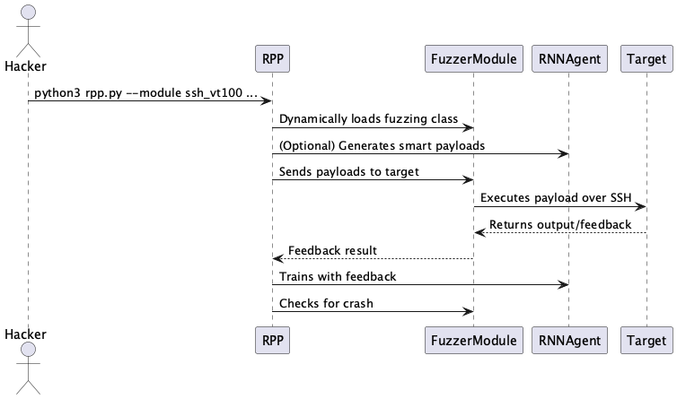
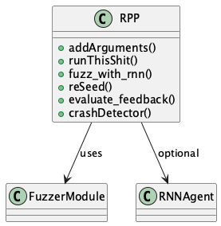
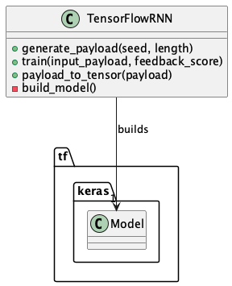
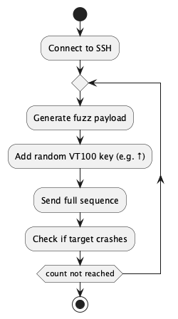

# Rocket Propelled POCs: Building Smarter Fuzzers with Python and Machine Learning

## Overview

This guide walks through how I built a modular fuzzing system called **RPP (Rocket Propelled POCs)**. It's a Python CLI tool that:

Loads and runs different fuzzing modules
Optionally uses a TensorFlow RNN to generate "smart" payloads
Simulates terminal behavior using VT100 style inputs (arrows, tab, enter)
Detects and reacts to target crashes

It is simple to extend and supports dynamic module loading. Let's walk through how everything fits together.   

The repository for the code can be found here: https://github.com/DBA1337TECH/TwilightFangInstill

## High Level Architecture

   

## Components and Code Breakdown

### 1. rpp.py   The Launcher

This is the CLI entry point. It handles:

  Argument parsing
  Random seeding
  Dynamic fuzz module loading
  Optional RNN based payload generation
  Crash detection

It does **not** fuzz directly it delegates that to loaded modules.


   

### 2. rnn_agent.py   RNN Based Payload Generator

This component creates payloads using a TensorFlow RNN. It learns from feedback (like crash messages) and tries to improve over time.

Main functions:

`generate_payload`: Given a seed, outputs a sequence of characters
`train`: Uses a feedback score to update the model
`payload_to_tensor`: Converts payload to numeric input




### 3. ssh_vt100.py   VT100 Terminal Fuzzer over SSH

This module simulates VT100 style terminal interaction via SSH:

  Sends arrow keys, escape, enter, and fuzzed text
  Useful for embedded shells or legacy command interfaces
  Inherits from `SSHParamikoFuzzer` and connects to SSH target

Example interaction: simulate command history navigation and malformed command input.



   

## Example Usage

Run the SSH fuzzer against a target like this:

```bash
python3 rpp.py \
    module ssh_vt100 \
    target 192.168.1.42 \
    port 22 \
    username root \
    password secret \
    use agent
```

   

## Crash Detection

After sending each payload, RPP checks if the target is still responding.

If it’s not, the crash banner prints with the current seed:

```
*******************************************
********  Crash Detected  *****************
******** Seed: 3281551982  ****************
*******************************************
```

You can then re use this seed to reproduce the issue.

   

## Files that are Noteworthy

```text
rpp.py             # Main CLI and orchestrator
rnn_agent.py       # TensorFlow RNN based payload generator
ssh_vt100.py       # VT100 SSH fuzzer module
rpp/models/...     # Shared base fuzzer classes (e.g., SSHParamikoFuzzer)
```

   

## Future Improvements

  Replace RNN with Transformer for smarter payloads
  Add coverage feedback using Frida or QEMU
  Store crash results in SQLite or JSON
  Auto generate crash repro scripts
  Build web UI for managing fuzzer runs

   

## Summary

RPP is a modular, Python powered fuzzing framework with optional AI integration. It supports:

  Dynamic module loading
  Reproducible randomness with seed control
  VT100 simulation for realistic interaction
  Crash feedback loop for learning fuzzers

It's minimal, extensible, and built for experimentation.

   
