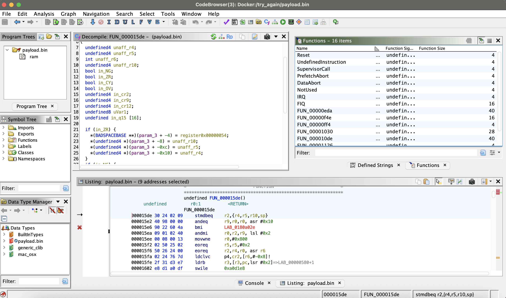

# Payload Preliminary Analysis (Still ongoing)

This Blog post was written after generating artifacts from a suspicious image sent suspected to using CVE-2025-43300, a script was also made to extract elf, and potential low entropy sections for more dissasmbly from the provided artifacts: a disassembly dump of the ELF container’s `.payload_data` section and a strings dump of the carved payload.


below is a screnshot of what I'm starting to decompile from the exttracted payload.bin which I was not expecting to even be able to get functions to produce in ghidra.

--



--

--

## Summary Verdict

First the fact theres a high amount of code that can be extracted is definitely worrisome from a JPEG.  a lot of analysis is still warranted. some instructions and jumps occur, but volume of `<unknown>`/nonsense suggests this is not a clean executable. Further carving or decoding may be required before disassembly.


# Ghidra Supervisor Call

```c

/* WARNING: Control flow encountered bad instruction data */

void SupervisorCall(undefined4 param_1,undefined4 param_2,undefined4 param_3,undefined4 param_4)

{
  undefined4 *unaff_r4;
  int unaff_r5;
  undefined4 *unaff_r6;
  undefined4 unaff_r8;
  undefined4 *unaff_r10;
  undefined4 unaff_r11;
  bool in_ZR;
  
                    /* /* WARNING: Control flow encountered bad instruction data */
                       
                       void SupervisorCall(undefined4 param_1,undefined4 param_2,undefined4
                       param_3,undefined4 param_4)
                       
                       {
                         undefined4 *unaff_r4;
                         int unaff_r5;
                         undefined4 *unaff_r6;
                         undefined4 unaff_r8;
                         undefined4 *unaff_r10;
                         undefined4 unaff_r11;
                         bool in_ZR;
                         
                                           /* /* WARNING: Control flow encountered bad instruction
                       data */
                                              
                                              void SupervisorCall(undefined4 param_1,undefined4
                       param_2,undefined4
                                              param_3,undefined4 param_4)
                                              
                                              {
                                                undefined4 *unaff_r4;
                                                int unaff_r5;
                                                undefined4 *unaff_r6;
                                                undefined4 unaff_r8;
                                                undefined4 *unaff_r10;
                                                undefined4 unaff_r11;
                                                bool in_ZR;
                                                
                                                                  /* /* WARNING: Control flow e
                       ...[truncated] */
  if (in_ZR) {
    *unaff_r4 = 0x4403;
    unaff_r10[unaff_r5 * -0x400] = 0x4403;
    *unaff_r6 = 0x4403;
    *unaff_r10 = unaff_r11;
    unaff_r10[-1] = unaff_r8;
    unaff_r10[-2] = param_4;
    unaff_r10[-3] = param_3;
    unaff_r10[-4] = 0x4403;
    software_interrupt(0xd0f10);
  }
                    /* WARNING: Bad instruction - Truncating control flow here */
  halt_baddata();
}

```
### Supervisor Function Decompiled in Ghidra Oddities

In laymans terms:

**If condition flag Z == 1, perform some register stores, trigger SVC #0xD0F10, then fault.**

- What It Could Indicate

This could be any of the following:

An intentionally malformed SVC handler (for privilege escalation, trap, or firmware debugging).
The SVC #0xD0F10 could correspond to a vendor specific OS service or hypervisor call.

Obfuscated / packed code where data bytes are disguised as instructions (Ghidra “bad instruction data”).

Corrupted disassembly — common if the image is data misaligned or Thumb/ARM mode mismatch.
(Ghidra ARM analysis sometimes disassembles as ARM mode when it should be Thumb mode.)

other dissasembly is as follows:

```

/* WARNING: Control flow encountered bad instruction data */

void FUN_000015de(undefined4 param_1,undefined4 param_2,int param_3)

{
  undefined4 unaff_r4;
  undefined4 unaff_r5;
  int unaff_r6;
  undefined4 unaff_r10;
  bool in_NG;
  bool in_ZR;
  bool in_CY;
  bool in_OV;
  undefined4 in_cr2;
  undefined4 in_cr9;
  undefined4 in_cr12;
  undefined8 uVar1;
  undefined in_q15 [16];
  
  if (in_ZR) {
    *(BADSPACEBASE **)(param_3 + -4) = register0x00000054;
    *(undefined4 *)(param_3 + -8) = unaff_r10;
    *(undefined4 *)(param_3 + -0xc) = unaff_r5;
    *(undefined4 *)(param_3 + -0x10) = unaff_r4;
  }
  if (in_NG) {
                    /* WARNING: Bad instruction - Truncating control flow here */
    halt_baddata();
  }
  if (!in_OV) {
    coprocessor_loadlong(4,in_cr2,unaff_r6 + -8);
  }
  if (in_ZR || in_NG != in_OV) {
    software_interrupt(0xa0d1e8);
  }
  if (!in_CY || in_ZR) {
    coprocessor_movefromRt(10,7,0,in_cr12,in_cr9);
  }
  uVar1 = VectorShiftRightNarrow(in_q15,0x19,4,0);
  SatQ(uVar1,4,0);
                    /* WARNING: Bad instruction - Truncating control flow here */
  halt_baddata();
}

```


### Quick and Dirty Analysis
#### Highlevel Explanation

The function FUN_000015de appears to:

Observe CPU condition flags: Negative (in_NG), Zero (in_ZR), Carry (in_CY), and Overflow (in_OV).

If the Zero flag is set, it stores several register values onto a stack area referenced by param_3 (writes four words at param_3 0x10 .. param_3 - 4). The value register0x00000054 is probably a register value or a placeholder for some CPU register contents (Ghidra uses BADSPACEBASE when it cannot map an address cleanly).

If the Negative flag is set, it immediately halts (bad instruction) — implying either a trap on negative condition or that the decompiler mis-decoded and the code path is invalid.

If Overflow (in_OV) is clear, it calls coprocessor_loadlong(4, in_cr2, unaff_r6 - 8). That smells like CP (coprocessor) load — e.g., VFP/NEON or system coprocessor access that loads a long vector/quadword.

If Zero is set OR NG != OV (i.e., negative differs from overflow, a signed overflow detection), it calls a software interrupt software_interrupt(0xa0d1e8) — likely a trap or kernel call on error/exception.

If not Carry OR Zero is set, it calls coprocessor_movefromRt(10,7,0,in_cr12,in_cr9) — another coprocessor register move (read some coprocessor register(s) into CPU regs).

Then performs a vector operation: uVar1 = VectorShiftRightNarrow(in_q15, 0x19, 4, 0); followed by SatQ(uVar1, 4, 0) — i.e., a vector right shift with narrowing and a saturating Q (saturation Q) instruction. This is textbook NEON/VFP SIMD behavior: shifting a vector and saturating the result.

Finally, the decompiler reaches a halt_baddata() — meaning the linear control flow ran into data, bad opcode, or the decompiler gave up.

So, overall: vector/coprocessor code with conditional error trapping and register save steps. Could be part of a DSP/crypto/signal processing routine that checks flags and calls the fault handler on certain conditions.

The warnings and the final halt_baddata() indicate Ghidra’s decompiler walked into bytes that are not valid instructions with the current CPU mode / endianness / alignment.

Common causes:

Wrong processor mode: code is in Thumb vs ARM mode (or 32bit vs 64bit mismatch).

Mixed code+data: disassembly drifted into a data blob.

Obfuscation / self modifying code: intentionally invalid opcodes trigger traps.

Endianness mismatch: interpreting LE bytes as BE or vice versa.

Because coprocessor and NEON sequences often encode many bits specially, a wrong mode will look especially noisy and produce such warnings.


**Disassembly shape:** `<unknown>` opcodes: 5086, calls: 152, jumps: 294, hlt: 185.

**Strings overview:** 1441 printable lines; 212 length≥6; URLs: 0, domains: 2, emails: 0, IPs: 0.

## Representative Disassembly Excerpts

### Excerpt 1

```asm
payload_as_object.elf:	file format elf64-x86-64
Disassembly of section .payload_data:
0000000000000000 <.payload_data>:
       0: 00 00                        	addb	%al, (%rax)
       2: ff db                        	<unknown>
       4: 00 43 00                     	addb	%al, (%rbx)
       7: 04 03                        	addb	$0x3, %al
       9: 03 04 03                     	addl	(%rbx,%rax), %eax
       c: 03 04 04                     	addl	(%rsp,%rax), %eax
       f: 03 04 05 04 04 05 06         	addl	0x6050404(,%rax), %eax
      16: 0a 07                        	orb	(%rdi), %al
      18: 06                           	<unknown>
```

### Excerpt 2

```asm
    81a9: 51                           	pushq	%rcx
    81aa: f6 93 f7 32 3e d2            	notb	-0x2dc1cd09(%rbx)
    81b0: 99                           	cltd
    81b1: 4f b3 0f                     	movb	$0xf, %r11b
    81b4: da b2 42 f6 9c 4a            	fidivl	0x4a9cf642(%rdx)
    81ba: 8c 05 f4 93 8b 90            	movw	%es, -0x6f746c0c(%rip)  # 0xffffffff908c15b4 <.payload_data+0xffffffff908c15b4>
    81c0: f0                           	lock
    81c1: 67 64 23 25 1f a8 84 22      	andl	%fs:0x2284a81f(%eip), %esp
    81c9: db b3 17 06 11 56            	<unknown>
    81cf: 88 f0                        	movb	%dh, %al
    81d1: 62                           	<unknown>
    81d2: 61                           	<unknown>
    81d3: 6b 17 4d                     	imull	$0x4d, (%rdi), %edx
    81d6: 2b dc                        	subl	%esp, %ebx
    81d8: 86 13                        	xchgb	%dl, (%rbx)
    81da: 89 28                        	movl	%ebp, (%rax)
```

### Excerpt 3

```asm
    fd0c: b8 71 1c 3d 61               	movl	$0x613d1c71, %eax       # imm = 0x613D1C71
    fd11: 02 47 c4                     	addb	-0x3c(%rdi), %al
    fd14: c5 89 c3                     	<unknown>
    fd17: 9d                           	popfq
    fd18: df dd                        	<unknown>
    fd1a: 6b 35 dd 38 30 f0 56         	imull	$0x56, -0xfcfc723(%rip), %esi # 0xfffffffff03135fe <.payload_data+0xfffffffff03135fe>
    fd21: b4 0b                        	movb	$0xb, %ah
    fd23: 63 8b 15 bd 09 b8            	movslq	-0x47f642eb(%rbx), %ecx
    fd29: 1e                           	<unknown>
    fd2a: e6 70                        	outb	%al, $0x70
    fd2c: 46 c3                        	retq
    fd2e: 64 0b 09                     	orl	%fs:(%rcx), %ecx
    fd31: 69 1b 08 44 92 4b            	imull	$0x4b924408, (%rbx), %ebx # imm = 0x4B924408
    fd37: 8e d2                        	movl	%edx, %ss
    fd39: 7b f9                        	jnp	0xfd34 <.payload_data+0xfd34>
    fd3b: eb f9                        	jmp	0xfd36 <.payload_data+0xfd36>
```

## Extracted Indicators from Strings

- No URLs found.

### Domains (heuristic)

- bM.
- y.
- No emails found.

- No IPv4s found.

## Keyword Hits (quick heuristic)

- `+x`: 1
## Next Steps / Suggestions

- Try **binwalk -e** on the payload to locate compressed containers (ZIP, Zlib, LZMA) or embedded files.
- Attempt **entropy reduction**: if this is encrypted/compressed, locate headers or magic bytes and decompress/decrypt accordingly before disassembly.
- In Ghidra, treat it as **raw binary** and experiment with alternative architectures (AArch64/ARM/MIPS) in small windows; but expect mostly noise if the bytes are not code.
- Revisit the **carving boundary**: carve from different offsets around the JPEG EOI or APP markers; ensure you’re not feeding Huffman-coded image data to the disassembler.
- If you suspect stego or custom packing, run a **known-plaintext crib** search or try **stego/steganography** scanners specialized for JPEG markers.

For future next steps, focus on revalidating the disassembly context and isolating legitimate code paths from decompiler noise. Begin by confirming the correct architecture and execution mode (ARM vs Thumb vs AArch64) for each suspect function; misalignment is the most common cause of “bad instruction data.” Once verified, re run Ghidra’s analysis with the corrected mode to produce cleaner disassembly. Then, extract and analyze the raw instruction bytes surrounding the SupervisorCall and FUN_000015de routines using objdump or Capstone to check if those instructions correspond to real SVC, LDC, VSHRN, or NEON operations. If confirmed, correlate the identified coprocessor and software interrupt IDs with known OS or firmware trap tables to determine their function (e.g., debugging hooks, cryptographic operations, or DSP kernels). Finally, map all functions referencing these addresses in Ghidra to visualize potential control flow entry points, and prepare a sandboxed environment like QEMU with appropriate CPU flags, to safely emulate their behavior if deeper runtime insights are needed.
