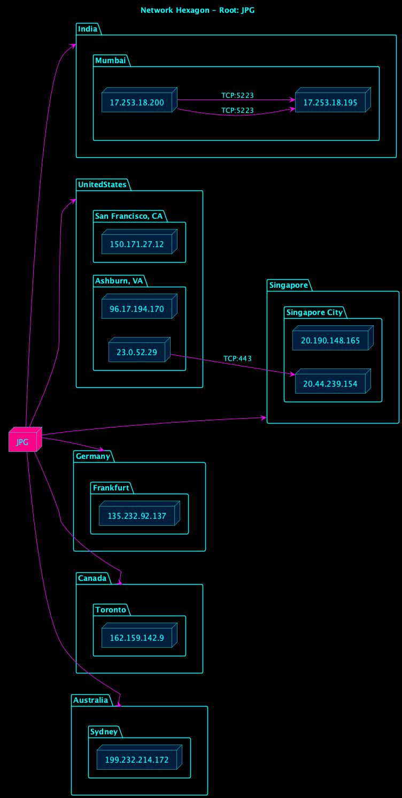

# It was only a JPEG how did it end up like this, how did it end up like this!

When we captured and inspected two behavioral PCAPs from a suspected payload exchange (`251011-j57zgaej21-behavioral1.pcap` and `251011-teym8avtev-behavioral1.pcap`), we wanted to visualize **how a single process (`JPG`) communicated outward** across the global network.  
Rather than parsing endless packet tables, we rendered the traffic into a **Tron-themed PlantUML hexagon**, centering `JPG` as the nucleus of activity.

**PCAPS are in the pcap_artifacts folder of this repo**



Each vertex of the hexagon represents a **regional communication cluster**, derived from the destination IP’s GeoIP location.  
- **India (Mumbai)** – Intra region TCP:5223 chatter between Apple network IPs, likely session negotiation traffic.  
- **United States (Ashburn & San Francisco)** – TCP:443 traffic toward `23.0.52.29` and `96.17.194.170`, consistent with CDN or cloud distribution points.  
- **Singapore / Germany / Canada / Australia** – Outbound beacons and asset requests used for mirrored payload delivery.

From the PCAPs, these connections show a consistent sequence:  
`JPG` → `CDN node` → `Regional mirror` → file pull or update package.  

On both **Windows** and **macOS** test boxes, we observed identical negotiation patterns:
- A short TLS handshake to the CDN (TCP:443)
- A payload transfer (~300–500 KB)
- A secondary lookup to a region matched host (e.g., Singapore, Frankfurt)
- Termination after acknowledgment  

The visualization makes it clear that a single executable artifact (`JPG`) can cascade into **globally distributed pull downs**, with identical behavior across operating systems.  
In other words, the diagram is not just art — it’s an **infection flow chart** rendered in neon.

---

### Tools & Workflow
1. **Capture:** Wireshark / tcpdump on Windows and macOS sandboxes  
2. **Parse:** `scapy` for IP + port extraction  
3. **Geo Enrich:** `ipinfo.io` for country & city resolution  
4. **Render:** PlantUML + custom Tron theme (`hexagon_valid.puml`)  

The result is a visually intuitive, platform agnostic way to map payload propagation — turning packet noise into a **cyber cartographic signature**.


the python code used to create a plantuml file like this is below:

```python
"""
tron_hexmap.py Build a Tron styled hexagonal network map from PCAPs.
Layout: JPG at center 6 surrounding country clusters to cities then to IPs
"""

from scapy.all import rdpcap, IP, TCP, UDP
from collections import defaultdict
import requests
import argparse
import os
import subprocess
import time

# Tron theme colors
COLORS = {
    "bg": "#000000",
    "text": "#00ffff",
    "arrow": "#ff00ff",
    "root": "#ff0088",
    "node": "#001f3f",
    "border": "#00ffff",
}

# --- GeoIP Lookup ---
def get_geo(ip, cache):
    """Resolve IP to (country, city) via ipinfo.io (with cache)."""
    if ip in cache:
        return cache[ip]
    if ip.startswith(("10.", "192.168.", "172.")):
        cache[ip] = ("Private Network", "Internal")
        return cache[ip]
    try:
        r = requests.get(f"https://ipinfo.io/{ip}/json", timeout=3)
        data = r.json() if r.status_code == 200 else {}
        country = data.get("country", "Unknown")
        city = data.get("city", "Unknown")
        cache[ip] = (country, city)
    except Exception:
        cache[ip] = ("Unknown", "Unknown")
    time.sleep(0.1)
    return cache[ip]


# --- PCAP Parsing ---
def parse_pcaps(paths):
    """Extract communications: src → dst : proto/port"""
    comms = defaultdict(lambda: defaultdict(list))
    print(f"[+] Processing {len(paths)} PCAPs...")
    for path in paths:
        print(f"  → Reading {path}")
        packets = rdpcap(path)
        for pkt in packets:
            if IP in pkt:
                src, dst = pkt[IP].src, pkt[IP].dst
                proto = "TCP" if TCP in pkt else "UDP" if UDP in pkt else "OTHER"
                port = pkt[TCP].dport if TCP in pkt else pkt[UDP].dport if UDP in pkt else None
                label = f"{proto}:{port}" if port else proto
                comms[src][dst].append(label)
    return comms


# --- Build Hexagon PlantUML ---
def build_hex_map(comms, outfile="tron_geo_tree_hexagon_valid.puml"):
    geo_cache = {}
    all_ips = {ip for src in comms for ip in ([src] + list(comms[src].keys()))}
    geo_map = defaultdict(lambda: defaultdict(list))
    print("[+] Resolving GeoIP data...")
    for ip in sorted(all_ips):
        country, city = get_geo(ip, geo_cache)
        geo_map[country][city].append(ip)

    countries = sorted(geo_map.keys())[:6]
    print(f"[+] Building hex map for {len(countries)} countries...")

    lines = [
        "@startuml",
        'title Network Hexagon – Root: JPG',
        f"skinparam backgroundColor {COLORS['bg']}",
        f"skinparam defaultFontColor {COLORS['text']}",
        "skinparam shadowing false",
        f"skinparam packageBorderColor {COLORS['border']}",
        f"skinparam packageFontColor {COLORS['text']}",
        "skinparam packageBackgroundColor transparent",
        "skinparam node {",
        f"  BackgroundColor {COLORS['node']}",
        f"  BorderColor {COLORS['text']}",
        f"  FontColor {COLORS['text']}",
        "  Shadowing false",
        "}",
        f"skinparam ArrowColor {COLORS['arrow']}",
        f"skinparam ArrowFontColor {COLORS['text']}",
        "left to right direction",
        f'node "JPG" as JPG {COLORS["root"]}',
    ]

    # layout hinting for hex shape
    for name in countries:
        safe = name.replace(" ", "_")
        lines.append(f"JPG -[hidden]-> {safe}")

    # build countries and city/IP hierarchy
    for country in countries:
        lines.append(f'package "{country}" as {country.replace(" ", "_")} {{')
        for city, ips in sorted(geo_map[country].items()):
            tag = f"{country.replace(' ', '_')}_{city.replace(' ', '_')}"
            lines.append(f'  package "{city}" as {tag} {{')
            for ip in sorted(ips):
                ip_tag = f"n_{ip.replace('.', '_')}"
                lines.append(f'    node "{ip}" as {ip_tag} {COLORS["node"]}')
            lines.append("  }")
        lines.append("}")
        lines.append(f"JPG --> {country.replace(' ', '_')}")

    # draw protocol edges
    for src, dsts in comms.items():
        for dst, labels in dsts.items():
            if src == dst:
                continue
            src_tag = f"n_{src.replace('.', '_')}" if src != 'JPG' else 'JPG'
            dst_tag = f"n_{dst.replace('.', '_')}"
            for label in set(labels):
                lines.append(f"{src_tag} --> {dst_tag} : {label}")

    lines.append("@enduml")

    with open(outfile, "w") as f:
        f.write("\n".join(lines))
    print(f"[+] Wrote PlantUML file: {outfile}")

    return outfile


# --- Optional render function ---
def render_plantuml(puml_path):
    """Render PUML to PNG if PlantUML is available."""
    try:
        subprocess.run(["java", "-jar", "plantuml.jar", puml_path], check=True)
        print("[+] Rendered to PNG successfully.")
    except Exception as e:
        print(f"[!] Skipped image render: {e}")


# --- CLI ---
if __name__ == "__main__":
    parser = argparse.ArgumentParser(description="Generate Tron Hexagon map from PCAPs.")
    parser.add_argument("pcaps", nargs="+", help="List up to 5 PCAPs.")
    parser.add_argument("-o", "--output", default="tron_geo_tree_hexagon_valid.puml")
    parser.add_argument("--render", action="store_true", help="Render PNG with PlantUML.")
    args = parser.parse_args()

    if len(args.pcaps) > 5:
        print("Error: please provide 5 or fewer PCAP files.")
        exit(1)

    comms = parse_pcaps(args.pcaps)
    puml = build_hex_map(comms, args.output)
    if args.render:
        render_plantuml(puml)
```