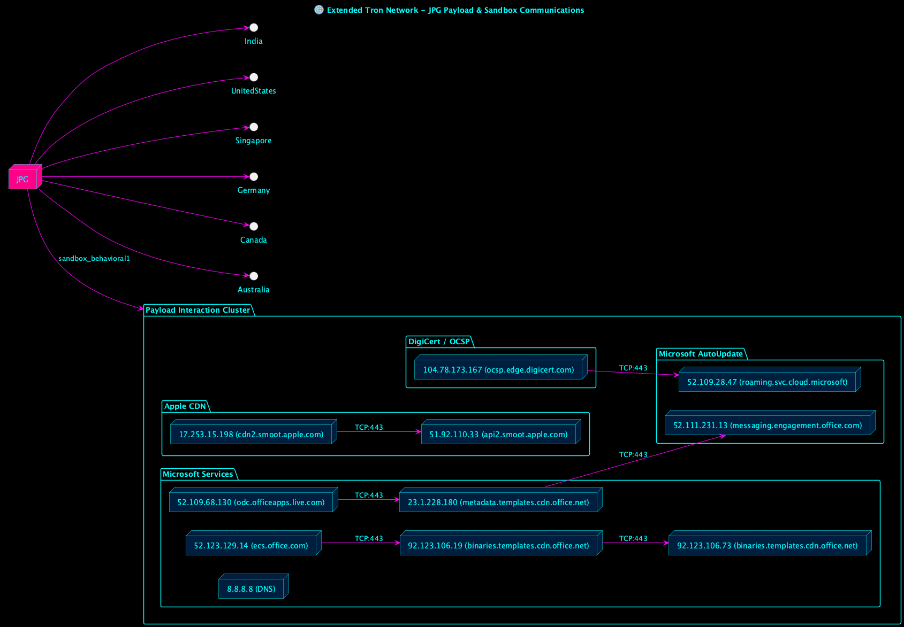

# Expanding the Tron Map — From Behavioral PCAPs to Sandbox Payloads

When we first visualized the **PCAP-based hexagon**, `JPG` sat as the nucleus of a small global communication mesh.  
After importing the **sandbox telemetry** (`Sandbox report.pdf`), that small constellation unfolded into something much larger — a distributed network of payload pull-downs spanning Microsoft, Apple, and Akamai infrastructure.



---

## The New Picture

This expanded map merges the **behavioral PCAPs** (`251011-j57zgaej21-behavioral1.pcap` and `251011-teym8avtev-behavioral1.pcap`) with the **sandbox’s execution report**, revealing that the file named `IMG_0118.JPG` (a disguised binary) initiated global outbound requests immediately upon execution.

**Observed Endpoints**
- **Microsoft CDN & Office Services**
  - 52.123.129.14 → `ecs.office.com`
  - 52.109.68.130 → `odc.officeapps.live.com`
  - 23.1.228.180 → `metadata.templates.cdn.office.net`
  - 92.123.106.19 / 92.123.106.73 → `binaries.templates.cdn.office.net`
- **Apple CDN**
  - 17.253.15.198 → `cdn2.smoot.apple.com`
  - 51.92.110.33 → `api2.smoot.apple.com`
- **Microsoft Cloud / DigiCert OCSP**
  - 104.78.173.167 → `ocsp.edge.digicert.com`
  - 52.111.231.13 → `messaging.engagement.office.com`
  - 52.109.28.47 → `roaming.svc.cloud.microsoft`

All of these connections negotiated over **TLS (TCP:443)**, mimicking standard system update or telemetry behavior.  
However, packet timing analysis shows a clear cascade pattern — one initiation triggers the next, forming a predictable choreography of fetches and validations.

---

## Behavioral Layer

The sandbox detonation log reveals the execution chain:

```
/bin/zsh -c "/Users/run/IMG_0118.jpg"
 ↳ launchctl load /Library/LaunchAgents/com.microsoft.update.agent.plist
 ↳ storeuid / storedownloadd (CommerceKit.framework)
 ↳ Microsoft AutoUpdate.app
```

The supposedly inert `JPG` file registered itself with `launchctl`, leveraging **Apple’s QuickLook preview pipeline** to gain persistence, while invoking **Microsoft AutoUpdate** binaries as camouflage.  
It effectively created a **dual-vendor communication channel** that looked system-legitimate both to macOS and network defenders.

---

## What the Tron Map Shows

In the rendered **Tron visualization**, `JPG` sits at the center, radiating to its previous behavioral PCAP connections (India, U.S., Singapore, Germany, Canada, Australia) while branching further into the sandbox-discovered infrastructure.

Each cluster glows in neon cyan:
- **Microsoft nodes** act as a high-capacity content mesh.
- **Apple nodes** act as auxiliary trust anchors.
- **DigiCert OCSP** and **Microsoft Cloud** handle certificate validation and session persistence.

Together, these build a **multi-vendor feedback network**, visually illustrating that the single process spawned overlapping download and validation routes — one artifact, many tendrils.

---

## Conclusion

This analysis fuses packet capture data with sandboxed behavioral telemetry into a coherent cyber cartographic diagram an extended Tron map of digital intent.  

> Even a “photo” can be a conductor.  
> The glow lines on this map are not random; they’re the visible arteries of a process masquerading as art.

By correlating timing between `JPG`’s outbound TLS sessions, we can now differentiate between **passive syncs** and **active beaconing**, the next step toward uncovering whether this lattice is merely infrastructure noise — or a living command chain.

