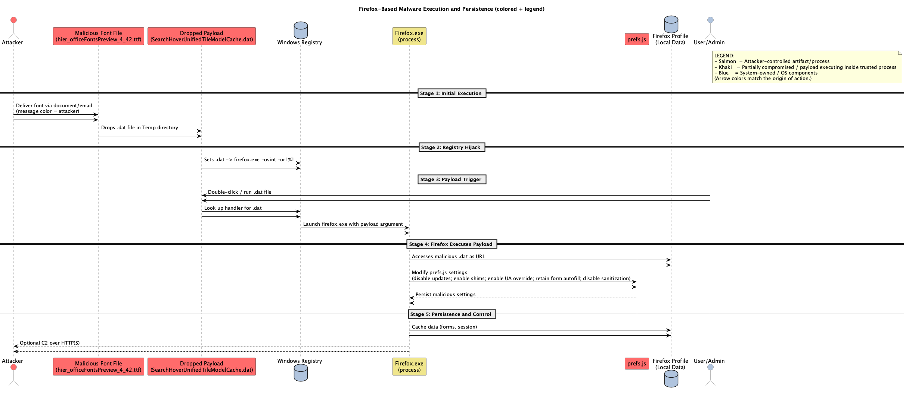

# Font → Firefox Malware Delivery: A Security Researcher's Analysis
**Date:** 2025-10-17

**Contents:** 
summary, evidence, detailed attack chain, `prefs.js` analysis, PlantUML diagrams (final), and source file links.

## Statement from the Author: Blake De Garza

I think it's important to not be detered by organizations who monitor and exploit journalists or dissidents.  
In essence when somone attempts to hack your phone or computer and it scares you, that is sometimes their main intent is to place fear into someone and their mind to not report on the organization because it would expose them.
This is troubling and must not happen in our free society, but freedom is not free and their are times where we must stand up to tyranny and fight back.
This is not the time to fight, but to observe and listen and understand these payloads in order to categorize in order to strike later.  The organizations too have a side of the story, and it's important to listen to all sides.  so I am listening, and I am trying to understand, but until then I will observe and stay quiet.

In the words of backtrack5, the quieter you are, the more you hear.

So I hope my voice rings true and when an organization tries to take anyone's voice away, is when my mission began.  
Whomever this hacker(s) is, does not like freedom, and they are trying very hard to monitor what journalists and dissidents of wherever this organizations home country is.  I think this because according to Apple this type of malware which was ultimately pulled from a .jpeg file sent to my i-phone has been stated that it is a [sophisticated targeted attack](https://www.darkreading.com/vulnerabilities-threats/apple-zero-day-flaw-sophisticated-attack) on [individuals whom are journalists and dissidents](https://winbuzzer.com/2025/06/13/apple-confirms-iphone-flaw-was-used-to-spy-on-journalists-xcxwbn/) I am in no way a journalist, but I am a Security Researcher, and I'm more simply a hacker whom hacks back against tryanny.

I will always speak up for the voiceless, and I will always fight to protect and, at times, to restore the Constitution of the United States.  


\- Blake De Garza

---

## 1. Executive Summary
This document consolidates the analysis performed over the course of a week: a malicious font artifact (Level 7 report) drops a disguised `.dat` payload which is associated with Firefox via registry hijack and executed using `firefox.exe -osint -url %1`. The payload leverages Firefox as an execution host, modifies `prefs.js` for persistence and reduced updates/security, performs memory injection and inprocess actions (WriteProcessMemory, SetWindowsHookEx), and may contact attacker C2. Persistent mechanisms include a `.dat` file association in the user registry and Task Scheduler COM API usage.

**High-level chain:**
1. Malicious font triggers/exploits a font parsing bug and drops `SearchHoverUnifiedTileModelCache.dat` (payload).  
2. The payload writes registry keys mapping `.dat` to `firefox.exe -osint -url "%1"`.  
3. User or process launches the `.dat`; Windows resolves the handler and launches Firefox with the `.dat` as a URL.  
4. Firefox processes the payload, which modifies `prefs.js` (disables updates, enables shims/UA overrides, retains autofill, disables sanitization), injects into Firefox processes, and may exfiltrate data.  
5. Persistence is maintained via registry association and Task Scheduler COM API.

---

## 2. Artifacts (uploaded / referenced files)
- `FONT_REPORT_LEVEL_7.pdf` — Font analysis & high-level trigger.
- `FontFile_Payload.pdf` — Supporting payload file content / analysis. (uploaded)
- `SandBox_prefs.js.pdf` — Sandbox analysis and `prefs.js` content extracted
- `SearchHover_Dat_File_Report_level_3.pdf` — Sandbox detonation of `SearchHoverUnifiedTileModelCache.dat` showing registry modification, WriteProcessMemory calls, SetWindowsHookEx, and Task Scheduler usage. (uploaded)

> Files are present in the attacked box: `/mnt/data/FONT_REPORT_LEVEL_7.pdf`, `/mnt/data/FontFile_Payload.pdf`, `/mnt/data/SandBox_prefs.js.pdf`, `/mnt/data/SearchHover_Dat_File_Report_level_3.pdf`.

---

## 3. Key Findings / Evidence (extracted from sandbox outputs and prefs.js)
- **Registry `.dat` association to Firefox**  
  Evidence: sandbox analysis shows the payload creates keys under `HKU\<SID>\Software\Classes` mapping `.dat` → `dat_auto_file` and the `open\command` value set to: `"C:\Program Files\Mozilla Firefox\firefox.exe" -osint -url "%1"` (SearchHover dat report). See: `SearchHover_Dat_File_Report_level_3.pdf` (Behavioral) pages summarizing `Key created ... shell\open\command = "\"C:\\Program Files\\Mozilla Firefox\\firefox.exe\" -osint -url \"%1\""` and the command line executed: `cmd /c C:\Users\Admin\AppData\Local\Temp\SearchHoverUnifiedTileModelCache.dat`.

- **Execution via Firefox**  
  Evidence: Multiple entries in sandbox logs show `wscript.exe C:\Users\Admin\AppData\Local\Temp\prefs.js` and many `firefox.exe` content processes spawned with `-prefsHandle` and other args. The `SearchHover` and `prefs.js` sandbox outputs show Firefox being launched repeatedly with payload-related arguments and content processes instantiated (parsed from the PDF reports).

- **prefs.js changes / update-suppression**  
  Evidence: The provided `prefs.js` include flags like `app.update.auto.migrated = true` and `app.update.background.previous.reasons` referencing `app.update.auto=false` and environment limitations. The file also contains `extensions.webcompat.perform_injections = true` and `extensions.webcompat.perform_ua_overrides = true`, which allow injection/UA spoofing behavior.
  - The exact `prefs.js` lines were included

- **Process injection / memory writes**  
  Evidence: The sandbox reports show numerous `WriteProcessMemory` events where Firefox processes write into other Firefox process memory spaces (e.g., "PID 1812 wrote to memory of 3860"). This indicates in-process code writing / injection. See `SearchHover_Dat_File_Report_level_3.pdf` behavioral sections and `SandBox_prefs.js.pdf` parsed pages in the file-search snippets.

- **Task Scheduler COM API (persistence)**  
  Evidence: Both the `prefs.js` sandbox detonation and dat report flagged "Uses Task Scheduler COM API" as a persistence technique.

- **Other suspicious API usage**: AdjustPrivilegeToken (SeDebugPrivilege), SetWindowsHookEx, FindShellTrayWindow and SendNotifyMessage — all present in sandbox behavioral logs and summarized in the parsed text of the sandbox PDF outputs.

---

## 4. Detailed Attack Flow (Narrative + mapped to artifacts)
1. **Delivery**: The attacker delivers a crafted font (reported in `FONT_REPORT_LEVEL_7.pdf`). The font exploits a font parsing vulnerability when loaded by a document viewer or browser, allowing code execution or dropper behavior.  
   - Source: `FONT_REPORT_LEVEL_7.pdf` (font analysis; see uploaded file).

2. **Dropper Behavior**: The font or downstream code drops `SearchHoverUnifiedTileModelCache.dat` to `%LocalAppData%\Temp\`.  
   - Source: `SearchHover_Dat_File_Report_level_3.pdf` (detonation logs show `Drops .dat file in Temp directory` and the command lines used).

3. **Registry Hijack / File Association**: The dropped `.dat` sets user-level class association so Windows will open `.dat` files with Firefox using `-osint -url "%1"`. This effectively maps arbitrary file content to a "URL" launch in Firefox (trusted process).  
   - Source: `SearchHover_Dat_File_Report_level_3.pdf` (registry creation entries and open\command values).

4. **Trigger & Execution**: When the `.dat` is executed (manually or via `cmd /c`), Windows resolves the handler and launches `firefox.exe -osint -url <path>`. Firefox then reads the `.dat` content as a URL or content to process; the payload runs inside Firefox content/child processes.  
   - Evidence: sandbox logs showing `cmd /c C:\Users\Admin\AppData\Local\Temp\SearchHoverUnifiedTileModelCache.dat` and Firefox content process commandlines in `SandBox_prefs.js.pdf` parsed text.

5. **In-Process Activity**: The payload modifies `prefs.js` values (either by direct file write or through executed JS within Firefox), suppresses updates, enables webcompat shims and UA overrides, and leaves autofill available — all facilitating long-term persistence and stealth. It also performs memory writes/injection into Firefox processes (WriteProcessMemory), installs hooks (SetWindowsHookEx), adjusts privileges (SeDebugPrivilege), and uses Task Scheduler COM API for persistence.  
   - Sources: `prefs.js`, plus sandbox report sections showing WriteProcessMemory and Task Scheduler usage (`SearchHover` and `Sandbox_prefs` PDFs).

6. **Post-Exploitation**: The compromised Firefox holds credentials, forms, PDFs, and cached data; optional C2 communications occur over HTTP(S) originating from the browser context or from injected code. Data exfiltration and commanding are feasible via this channel.
   - Evidence: Behavior in sandbox logs

---

## 5. `prefs.js` — Notable Entries
Below are small excerpts called out as suspicious or meaningful in the attack context:

- `user_pref("app.update.background.previous.reasons", "[\"app.update.auto=false\",\"cannot usually check for updates due to policy, testing configuration, or runtime environment\"]");`
- `user_pref("extensions.webcompat.perform_injections", true);`
- `user_pref("extensions.webcompat.perform_ua_overrides", true);`
- `user_pref("privacy.sanitize.pending", "[{\"id\":\"newtab-container\",\"itemsToClear\":[],\"options\":{}}]");`
- `user_pref("dom.forms.autocomplete.formautofill", true);`
- Other standard prefs that may be repurposed (e.g., `pdfjs.enabledCache.state`, `browser.topsites.contile.cacheValidFor`)

**Interpretation:** the `prefs.js` entries show update suppression, injection/compat flags enabled, and no effective sanitization — all facilitating persistent, stealthy behavior inside the browser process.

---

## 6. PlantUML Diagram (final, colorized + legend)
Below is the final PlantUML sequence diagram code used in this chain. It includes colored lifelines and a legend corresponding to attacker-controlled vs compromised vs system-owned components. 




---

## 8. Next steps / Recommendations
- **Quarantine** any hosts where these artifacts were observed. Remove the registry hijack and restore `.dat` associations.  
- **Collect forensic artifacts**: `prefs.js` (profile folder), `%LocalAppData%\Temp\SearchHoverUnifiedTileModelCache.dat`, registry hive exports for the affected user (`HKU\<SID>\Software\Classes`), Firefox process memory dumps.  
- **Network**: Monitor for egress HTTP(s) traffic from Firefox; check for connections to suspicious domains.  
- **Remediation**: Re-enable updates, reset profile prefs (or rebuild profile), rotate credentials, remove persistence tasks, and run AV/EDR full scans. Consider a full rebuild of the user profile to avoid leftover injected code.  
- **Hunting**: Search endpoints for the registry mapping, any `.dat` files in Temp, and for scheduled tasks created around the observed timeframe.

---

# Appendix A: Prefs.js

```javascript
// Mozilla User Preferences

// DO NOT EDIT THIS FILE.
//
// If you make changes to this file while the application is running,
// the changes will be overwritten when the application exits.
//
// To change a preference value, you can either:
// - modify it via the UI (e.g. via about:config in the browser); or
// - set it within a user.js file in your profile.

user_pref("app.normandy.first_run", false);
user_pref("app.normandy.migrationsApplied", 12);
user_pref("app.normandy.user_id", "a039b62d-01f9-4bc7-8394-0a0dde59b9c3");
user_pref("app.shield.optoutstudies.enabled", false);
user_pref("app.update.auto.migrated", true);
user_pref("app.update.background.previous.reasons", "[\"app.update.auto=false\",\"cannot usually check for updates due to policy, testing configuration, or runtime environment\"]");
user_pref("app.update.background.rolledout", true);
user_pref("app.update.lastUpdateTime.browser-cleanup-thumbnails", 0);
user_pref("app.update.lastUpdateTime.region-update-timer", 0);
user_pref("app.update.lastUpdateTime.xpi-signature-verification", 0);
user_pref("browser.bookmarks.addedImportButton", true);
user_pref("browser.bookmarks.restore_default_bookmarks", false);
user_pref("browser.contentblocking.category", "standard");
user_pref("browser.contextual-services.contextId", "{8bcc0bf6-60c1-4893-a44c-c1a9cf5bcc08}");
user_pref("browser.download.viewableInternally.typeWasRegistered.avif", true);
user_pref("browser.download.viewableInternally.typeWasRegistered.webp", true);
user_pref("browser.launcherProcess.enabled", true);
user_pref("browser.migration.version", 150);
user_pref("browser.newtabpage.activity-stream.impressionId", "{49f1a290-c52f-4089-b88b-868b9e0d5b47}");
user_pref("browser.newtabpage.storageVersion", 1);
user_pref("browser.pageActions.persistedActions", "{\"ids\":[\"bookmark\"],\"idsInUrlbar\":[\"bookmark\"],\"idsInUrlbarPreProton\":[],\"version\":1}");
user_pref("browser.pagethumbnails.storage_version", 3);
user_pref("browser.policies.applied", true);
user_pref("browser.privacySegmentation.createdShortcut", true);
user_pref("browser.proton.toolbar.version", 3);
user_pref("browser.region.update.updated", 1749600674);
user_pref("browser.safebrowsing.provider.mozilla.lastupdatetime", "1749600676700");
user_pref("browser.safebrowsing.provider.mozilla.nextupdatetime", "1749622276700");
user_pref("browser.search.region", "GB");
user_pref("browser.search.serpEventTelemetryCategorization.regionEnabled", false);
user_pref("browser.startup.couldRestoreSession.count", 2);
user_pref("browser.startup.lastColdStartupCheck", 1749605336);
user_pref("browser.topsites.contile.cacheValidFor", 10497);
user_pref("browser.topsites.contile.lastFetch", 1749605336);
user_pref("browser.uiCustomization.state", "{\"placements\":{\"widget-overflow-fixed-list\":[],\"unified-extensions-area\":[],\"nav-bar\":[\"back-button\",\"forward-button\",\"stop-reload-button\",\"customizableui-special-spring1\",\"vertical-spacer\",\"urlbar-container\",\"customizableui-special-spring2\",\"save-to-pocket-button\",\"downloads-button\",\"fxa-toolbar-menu-button\",\"unified-extensions-button\"],\"toolbar-menubar\":[\"menubar-items\"],\"TabsToolbar\":[\"firefox-view-button\",\"tabbrowser-tabs\",\"new-tab-button\",\"alltabs-button\"],\"vertical-tabs\":[],\"PersonalToolbar\":[\"import-button\",\"personal-bookmarks\"]},\"seen\":[\"save-to-pocket-button\",\"developer-button\"],\"dirtyAreaCache\":[\"nav-bar\",\"vertical-tabs\",\"PersonalToolbar\",\"toolbar-menubar\",\"TabsToolbar\"],\"currentVersion\":21,\"newElementCount\":2}");
user_pref("browser.urlbar.placeholderName", "Google");
user_pref("browser.urlbar.quicksuggest.migrationVersion", 2);
user_pref("browser.urlbar.quicksuggest.scenario", "history");
user_pref("captchadetection.lastSubmission", 1749600);
user_pref("datareporting.dau.cachedUsageProfileID", "beefbeef-beef-beef-beef-beeefbeefbee");
user_pref("distribution.iniFile.exists.appversion", "135.0");
user_pref("distribution.iniFile.exists.value", false);
user_pref("doh-rollout.doneFirstRun", true);
user_pref("doh-rollout.home-region", "GB");
user_pref("dom.forms.autocomplete.formautofill", true);
user_pref("dom.push.userAgentID", "bf6d63aa597d4cb3af3155ff138d4f09");
user_pref("extensions.activeThemeID", "default-theme@mozilla.org");
user_pref("extensions.blocklist.pingCountVersion", 0);
user_pref("extensions.databaseSchema", 37);
user_pref("extensions.formautofill.creditCards.reauth.optout", "MDIEEPgAAAAAAAAAAAAAAAAAAAEwFAYIKoZIhvcNAwcECHhuiPqYXNsvBAhz7OGB6pv/Cg==");
user_pref("extensions.lastAppBuildId", "20250130195129");
user_pref("extensions.lastAppVersion", "135.0");
user_pref("extensions.lastPlatformVersion", "135.0");
user_pref("extensions.pendingOperations", false);
user_pref("extensions.pictureinpicture.enable_picture_in_picture_overrides", true);
user_pref("extensions.systemAddonSet", "{\"schema\":1,\"addons\":{}}");
user_pref("extensions.webcompat.enable_shims", true);
user_pref("extensions.webcompat.perform_injections", true);
user_pref("extensions.webcompat.perform_ua_overrides", true);
user_pref("extensions.webextensions.ExtensionStorageIDB.migrated.screenshots@mozilla.org", true);
user_pref("extensions.webextensions.uuids", "{\"formautofill@mozilla.org\":\"d58b73c8-5f31-4d06-b0ee-d7e6cedb7ac8\",\"pictureinpicture@mozilla.org\":\"a8a17700-ac3d-4ef1-89ef-4c065a3794cf\",\"screenshots@mozilla.org\":\"5f9b2b39-953d-4a69-889e-72287a742d77\",\"webcompat-reporter@mozilla.org\":\"9c7498e6-3faf-4477-9893-608d464d3833\",\"webcompat@mozilla.org\":\"58d0f4b0-60d6-4b0a-88b0-706f2f511a5d\",\"default-theme@mozilla.org\":\"2f4a5c67-2394-43f5-9aac-ab8fa3e0d3ef\",\"addons-search-detection@mozilla.com\":\"bc1ccc92-1360-4f75-ae20-15c34619d5d5\"}");
user_pref("gecko.handlerService.defaultHandlersVersion", 1);
user_pref("media.gmp.storage.version.observed", 1);
user_pref("media.hardware-video-decoding.failed", false);
user_pref("pdfjs.enabledCache.state", true);
user_pref("pdfjs.migrationVersion", 2);
user_pref("privacy.bounceTrackingProtection.hasMigratedUserActivationData", true);
user_pref("privacy.sanitize.clearOnShutdown.hasMigratedToNewPrefs2", true);
user_pref("privacy.sanitize.pending", "[{\"id\":\"newtab-container\",\"itemsToClear\":[],\"options\":{}}]");
user_pref("sanity-test.device-id", "0x1111");
user_pref("sanity-test.driver-version", "10.0.19041.868");
user_pref("sanity-test.running", false);
user_pref("sanity-test.version", "20250130195129");
user_pref("sidebar.backupState", "{\"width\":\"\",\"command\":\"\",\"expanded\":false,\"hidden\":true}");
user_pref("signon.management.page.os-auth.optout", "MDIEEPgAAAAAAAAAAAAAAAAAAAEwFAYIKoZIhvcNAwcECEvxEodlNM9TBAihPMRFj9jNng==");
user_pref("toolkit.startup.last_success", 1749600673);
user_pref("toolkit.telemetry.cachedClientID", "fce14b28-6d10-447b-9433-dee34a98af0b");
user_pref("toolkit.telemetry.cachedProfileGroupID", "cd83c0c7-9945-4174-b719-30bbdea3aec4");
```