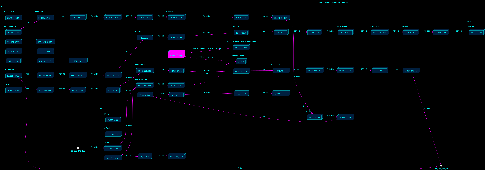

# A Digital Symphony

# Unofficial Title: WTF!

*October 25, 2025 — analysis by Blake De Garza*

## TL;DR
A benign looking image file (`icon.png`)  detonated in macOS sandboxes and triggered follow on activity across macOS and Windows stages. The image was executed like a program, caused DNS and CDN fetches (e.g., `8.8.8.8`, `17.253.10.201`), and produced a binary (`dafsaData.bin`) that showed persistence and other malicious behaviors in Windows detonations. Supporting sandbox reports and behavioral evidence are cited below (see "Supporting reports" section for filenames).

---

## Executive summary
- `latest.icon.png` was executed on macOS (shell invocation such as `/bin/zsh -c "/Users/run/latest.icon.png"`), which is an immediate red flag because images should not be executed as programs. The mac sandbox shows resource forking / defense evasion behaviors and outbound network activity. *(See `Sandbox report_latesticonimage.pdf`.)*  
- The mac run produced `dafsaData.bin`, which when executed in Windows sandboxes exhibited persistence (Task Scheduler / registry modifications), process injection like behaviors, and network callbacks. *(See `sandbox_completed_chain.pdf` and `18_5_MB_dll_sandbox.pdf`.)*  
- Additional stages observed across other detonations included `prefs-1.js` (JS executed under `wscript.exe`) and a DLL stage `widevinecdm.dll` run via `rundll32.exe`. These show the chain can include JS/DLL/BIN follow on payloads. *(See `prefs-1-js_sandbox_3.pdf`, `18_5_MB_dll_sandbox.pdf`.)*

## Command and Control (C2) Infrastructure

This diagram visualizes the entire payload delivery and command and control (C2) infrastructure for the latest.icon.png chain, organized geographically. The flow begins at the latest.icon.png node (bottom left, bright pink), representing the initial file execution that triggered DNS lookups and network activity. From there, the diagram traces outbound connections to Apple’s Sao Paulo data center (17.253.10.201), suggesting the first external payload fetch. The chain then branches through multiple U.S. regions—including Mountain View, Phoenix, Kansas City, and Redmond—illustrating hops between CDN and cloud infrastructure (e.g., Akamai, Microsoft Azure, and Google Cloud).

Each region contains IP nodes labeled by city and role, showing how the malware leveraged content networks for obfuscation and redundancy. The right side of the map depicts internal private network nodes (10.127.x.x) that communicate with external cloud hosts, indicating lateral movement or staged callbacks. Arrows marked “TLS 443” and “HTTP 80” denote encrypted and plain text connections, while side branches such as San Francisco and San Antonio are annotated as “C2 callback,” “lateral effect,” or “DLL retrieval.”

Overall, the flow demonstrates a multi stage, globally distributed command structure: initial access via image execution → CDN relay → U.S. cloud transit → C2 delivery → internal persistence. The geographic clustering clarifies that most external infrastructure is U.S. based with one Brazilian origin point, reinforcing the notion of a globally load balanced C2 network disguised as legitimate service traffic.

---

## Key findings & Indicators of Compromise (IoCs)

### Notable file artifacts & hashes (from the sandbox reports)
- `latest.icon.png` — SHA256: `9d1fef4ed8abeaa3cbd53c60aafa4b8774cf03c1bb3ad043c6d8f483528b9e14`. *(mac sandbox)* — `Sandbox report_latesticonimage.pdf`  
- `dafsaData.bin` — SHA256: `d74d0e429343f5e1b3e0b9437e048917c4343a30cff068739ea898bad8e37ffd`. *(completed chain/Windows sandbox)* — `sandbox_completed_chain.pdf`  
- `widevinecdm.dll` — SHA256: `3ed0dec36754402707c2ae4fbfa887fe3089945f6f7c1a8a3e6c1e64ad1c2648`. *(Windows DLL stage)* — `18_5_MB_dll_sandbox.pdf`  
- `prefs-1.js` — SHA256: `08f2f0a58ca7701d46634eaff0c021511a0f249e4e3ba292f3d435834cf0bc1c`. *(JS stage)* — `prefs-1-js_sandbox_3.pdf`

### Network hosts (examples observed)
- `8.8.8.8` — Public DNS used for lookups during mac detonation — `Sandbox report_latesticonimage.pdf`  
- `17.253.10.201` — Apple CDN / delivery host observed as an initial payload source — `Brazilian_img_in_email.pdf` / `Sandbox report_latesticonimage.pdf`  
- Various CDN/Azure/AWS endpoints and other cloud hosts appear as follow up and C2 candidates in the PCAPs and sandbox logs — see `sandbox_completed_chain.pdf` for the full list.

### Behavioral tags / MITRE mappings (observed)
- **T1564 (Defense Evasion)** — resource forking and misleading extension (file named `.png` but executed). *(mac sandbox)*  
- **Persistence** — Task Scheduler COM usage, registry class key modifications, autorun like behavior (Windows `dafsaData.bin`). *(completed chain Windows sandbox)*  
- **Command & Control / Exfiltration** — HTTPS callbacks to cloud/CDN/C2 like hosts following initial fetch.

---

## Reconstructed timeline (condensed)
1. **Delivery/Delivery Vector** — Attack arrives as an email/attachment containing `latest.icon.png`. (`Brazilian_img_in_email.pdf`)  
2. **Execution on macOS** — Image is executed (shell wrapper). DNS lookup(s) to public resolver(s) (e.g., `8.8.8.8`) and HTTP/TLS fetches to Apple CDN addresses are observed. (`Sandbox report_latesticonimage.pdf`)  
3. **Payload drop** — The mac execution writes out `dafsaData.bin` (or similar), and network activity continues to cloud/CDN hosts. (`Sandbox report_latesticonimage.pdf`, `sandbox_completed_chain.pdf`)  
4. **Windows stage** — `dafsaData.bin` or other stages (DLL/JS) execute in Windows contexts: `rundll32.exe ... widevinecdm.dll`, `wscript.exe prefs-1.js`, and `cmd /c ... dafsaData.bin` are recorded in different detonations — these stages perform persistence and privilege/discovery behaviors. (`18_5_MB_dll_sandbox.pdf`, `prefs-1-js_sandbox_3.pdf`, `sandbox_completed_chain.pdf`)  
5. **Persistence & C2** — Windows stage adds persistence (registry/class keys, scheduler), attempts callbacks to C2 candidates, and performs system discovery actions. (`sandbox_completed_chain.pdf`)

---

## Technical analysis & red flags
- **Executable disguised as an image:** The file extension and file name were used as camouflage; actual behavior (direct execution) indicates the file contains executable content (not just image data). *(See `Sandbox report_latesticonimage.pdf`)*  
- **Resource fork / macOS evasion:** Reported resource-fork techniques and shell wrapped execution are classic mac evasion tactics: attackers leverage macOS resource forks or alternative data streams to hide executables. *(See `Sandbox report_latesticonimage.pdf`)*  
- **Cross platform chain:** The mac stage produces artifacts that are malicious in Windows contexts — demonstrating a multi stage, cross platform delivery model. *(See `sandbox_completed_chain.pdf` and `18_5_MB_dll_sandbox.pdf`)*  
- **Use of legitimate CDN infrastructure:** Delivery via Apple CDN or other large CDNs can make detection by simple blocklists difficult — focus on anomalous sequences (new process → immediate HTTPS to CDN host not normally contacted by that process). *(See `Brazilian_img_in_email.pdf` and PCAP traces.)*

---

## Detection & containment recommendations

### Immediate triage
1. **Isolate any host** where `latest.icon.png`, `dafsaData.bin`, `widevinecdm.dll`, or `prefs-1.js` were executed. Capture memory, process lists, and relevant logs. *(Sandbox reports show exact execution command lines and file paths.)*  
2. **Block or monitor** outbound connections to the observed C2/CDN IPs temporarily while investigating. Prefer detection first where blocking CDNs could break legitimate business traffic.

### Hunting queries / detection signatures
- **macOS:** detect execution of files with image like extensions from shell interpreters:
  - E.g., log rule: detect `/bin/zsh -c "*/*.png"` or `sudo /bin/zsh -c "*latest.icon.png*"`  
  - Detect resource fork modifications or use of `xattr` on image files.
- **Windows (EDR):**
  - Detect `rundll32.exe *\AppData\Local\Temp\widevinecdm.dll,*`  
  - Detect execution of `*.bin` from temporary paths: `cmd /c C:\Users\*\AppData\Local\Temp\*.bin`  
  - Detect creation of new Class keys under `HKCU\Software\Classes\` that register new file associations for `.bin`.
- **Network:** flag unusual HTTPS to CDN/Apple CDN addresses immediately following a new process launch on endpoints; flag DNS requests to public resolvers from endpoints that don't normally make them.

### Remediation steps
- Remove the offending files and any dropped artifacts after imaging (`latest.icon.png`, `dafsaData.bin`, `widevinecdm.dll`, `prefs-1.js`).  
- Remove suspicious scheduled tasks and registry autoruns, and verify no hidden services remain. (`sandbox_completed_chain.pdf` contains the persistence details.)  
- Rotate credentials and scan for lateral movement indicators (use the lateral chain in this report as a guide).

---

## Appendix — supporting reports
- `Sandbox report_latesticonimage.pdf` — macOS detonation of `latest.icon.png`: execution command lines, xattr/resource fork notes, DNS & CDN callbacks.  
- `Brazilian_img_in_email.pdf` — contextual note & network hits to Apple CDN.  
- `18_5_MB_dll_sandbox.pdf` — Windows DLL stage (`widevinecdm.dll`) and rundll32 execution traces.  
- `prefs-1-js_sandbox_3.pdf` — JS stage (`prefs-1.js`) executed via `wscript.exe`.  
- `sandbox_completed_chain.pdf` — completed chain Windows analysis for `dafsaData.bin` showing persistence, registry, scheduler, and API level behaviors.  
- `6-rating_sandbox.pdf` — consolidated rating / severity notes used to assess risk.

---

**© 2025 Blake De Garza — ( A Digital Symphony)**