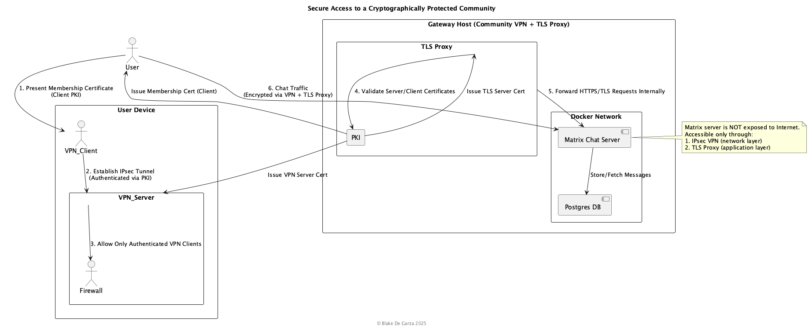

---
# The Cryptographic Renaissance: Engineering Safe Havens for Digital Thought

    By Blake De Garza
    November 2, 2025
---

# INTRODUCTION

This blog post has real implementations that are referenced below:

    https://github.com/DBA1337TECH/OblivionEdge
    https://github.com/DBA1337TECH/littleguyVPN

---

The modern internet is a paradox simultaneously the most liberating and the most 
monitored communication medium in human history. From the first ARPANET message 
to the encrypted tunnels of today, the tension between privacy and control has 
shaped the evolution of digital society.

As surveillance infrastructures expand, it becomes essential to reclaim the 
network  to build distributed, cryptographically provable systems that prioritize 
human freedom over convenience.

This document outlines current progress in that mission through three major 
technical projects:

    1. Oblivion Edge
    2. TLS Proxy
    3. PKI Certificate Provisioning

Together, these systems form the foundation of “micro-organizations”  secure 
digital communities where membership is authenticated cryptographically, not 
administratively. By combining VPN, TLS, and PKI technologies under a Zero Trust 
architecture, each community becomes a self-sovereign enclave within the larger 
internet  a digital safe house for free expression, research, and collaboration.

--- 

# TECHNICAL BLOBS THAT HAVE BEEN ACCOMPLISHED

---

---

## 1. OBLIVION EDGE  A ZERO TRUST ROUTER OPERATING SYSTEM

---

    Oblivion Edge represents a next-generation SOHO router OS designed around Zero 
    Trust Network Access (ZTNA) principles. Built atop the Linux-RT kernel, it 
    minimizes latency while enforcing strict cryptographic verification for every 
    packet and connection.

The system replaces traditional LAN/WAN trust boundaries with cryptographic trust:  
every device, every packet, every service must authenticate.

Key components:
    • ZTNA kernel module (C)  validates identity and session integrity.
    • WireGuard integration  each user/device owns a unique key.
    • nftables automation  per-user segmentation.
    • Rust-based CLI  manage VPN peers, PKI certs, user sessions.

Example (pseudo-bash):
```bash
    # Generate a new community VPN profile
    oblivion-admin-cli community create "MatrixNet"

    # Add a user device identity
    oblivion-admin-cli member add --community MatrixNet --name "alice" --issue-cert

    # Start the WireGuard VPN
    systemctl start oblivion-vpn@MatrixNet
```

These commands generate certificates, register them into the Oblivion PKI 
database, and spin up a WireGuard VPN interface that only permits traffic from 
verified keys.

---

## 2. TLS PROXY  OBFUSCATED GATEWAYS FOR SECURE COMMUNITIES

---

Inspired by the Signal TLS Proxy concept, the custom TLS Proxy acts as a front 
door for encrypted communities. It hides internal services (Matrix chat, code 
repos, file sharing) behind HTTPS endpoints indistinguishable from normal web 
traffic.

Each proxy instance validates mutual TLS credentials ensuring that only 
authorized members can connect and forwards encrypted traffic to the backend 
Docker network hosting the actual services.

ASCII representation of the architecture:

```text
    [User Device]
        │
        │ 1. Presents Membership Cert (PKI)
        ▼
    [VPN Client]───2.→ Establish IPsec Tunnel ─────────────────────────┐
                                                                  (VPN)
                                                                  ▼
                    ┌──────────────────────────────────────────────────────┐
                    │  Gateway Host (Community VPN + TLS Proxy)             │
                    │                                                      │
                    │ [IPsec VPN Server] ──→ Firewall Rules                │
                    │ [TLS Proxy] ──→ Validates Client Certs via PKI       │
                    │ [Docker Network]:                                    │
                    │     ├── Matrix Chat Server ──→ Postgres DB           │
                    │     └── (Internal only, not exposed to Internet)     │
                    └──────────────────────────────────────────────────────┘

    PKI Infrastructure:
        • Issues Membership Certificates
        • Issues VPN Server Certificates
        • Issues TLS Server Certificates
```

All user traffic is encrypted twice  once by the VPN layer (IPsec) and again by 
the TLS proxy. The proxy itself is only reachable from the VPN subnet, creating 
a cryptographically sealed enclave.

Below is a plantuml diagram for another visualization.



---

## 3. AUTOMATED PKI CERTIFICATE PROVISIONING

---

At the heart of the system lies the PKI engine  a Python-based certificate 
management service that issues, signs, renews, and revokes certificates used by 
VPN, TLS Proxy, and internal services.

Pseudo-Python example (illustrative Purposes only):

```python
    from cryptography import x509
    from cryptography.hazmat.primitives import serialization, hashes
    from cryptography.hazmat.primitives.asymmetric import rsa
    from datetime import datetime, timedelta

    def generate_certificate(common_name):
        key = rsa.generate_private_key(public_exponent=65537, key_size=4096)
        subject = issuer = x509.Name([
            x509.NameAttribute(x509.oid.NameOID.COMMON_NAME, common_name)
        ])
        cert = (
            x509.CertificateBuilder()
            .subject_name(subject)
            .issuer_name(issuer)
            .public_key(key.public_key())
            .serial_number(x509.random_serial_number())
            .not_valid_before(datetime.utcnow())
            .not_valid_after(datetime.utcnow() + timedelta(days=365))
            .sign(key, hashes.SHA256())
        )
        return cert, key

    cert, key = generate_certificate("alice@matrixnet.org")
    # Save certificate/key locally (omitted for brevity)
```

This illustrates automatic certificate issuance. Each new member joining a 
community receives a unique keypair and certificate signed by the internal CA  
their “membership card.” The PKI integrates with Oblivion Edge, allowing 
automatic rotation or revocation if compromise is detected.

---

# WHAT STILL NEEDS TO BE DONE

---

Despite significant progress, several milestones remain:

- 1. Zero Trust Policy Engine  
   • Implement dynamic, behavior-based access rules.  
   • Continuous validation beyond static certificates.  

- 2. Distributed CA Synchronization  
   • Each community operates its own CA, but can establish federated trust links.  
   • Enables inter-community communication without a central root.  

- 3. UI / UX for Gateways  
   • Build a lightweight web console for inviting, revoking, and monitoring 
     members through REST APIs connected to Oblivion Edge CLI.  

- 4. Immutable Audit Trails  
   • Record membership actions (issue/revoke) in an append-only Merkle ledger.  
   • Provides non-repudiation while preserving anonymity.  

- 5. Scalability Enhancements  
   • Containerize all components for orchestration via Nomad or Kubernetes.  
   • Introduce load-balanced VPN and proxy nodes for global resilience.  

- 6. Formal Verification & Attestation  
   • TPM-backed secure boot and remote attestation for every Oblivion node.  
   • Mathematical assurance of software integrity.  

---

# CONCLUSION

---

Freedom of thought begins with freedom of communication, and that freedom 
depends on secure software.

When systems are designed around trust minimization and cryptographic 
verifiability, they no longer rely on intermediaries  only mathematics.  
Oblivion Edge, TLS Proxies, and PKI provisioning together form a blueprint for 
reclaiming autonomy on the network.

By treating each community as a micro sovereign cryptographic entity, we resist 
mass surveillance and censorship not through protest but through architecture.  
Every certificate issued becomes a digital passport; every encrypted packet, a 
declaration of privacy.

The ultimate goal is not to hide from the world but to construct a freer one  
a web of trust built on distributed systems and open cryptography.

Freedom of Thought starts with securing the software and creating 
cryptographically provable systems for communicating securely through insecure 
channels. This is not merely technical work; it is a moral imperative that 
I hope that inspires other engineers, hackers, programmers, doers, and artists, from all walks of life.

---

**© Blake De Garza 2025 (The Cryptographic Renaissance)**

--
