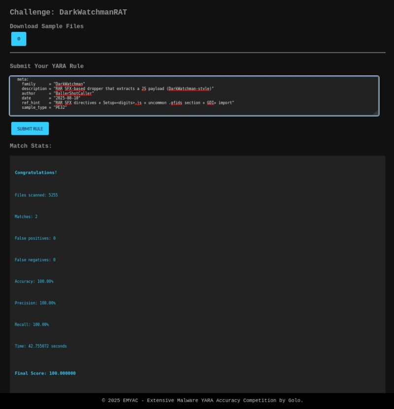
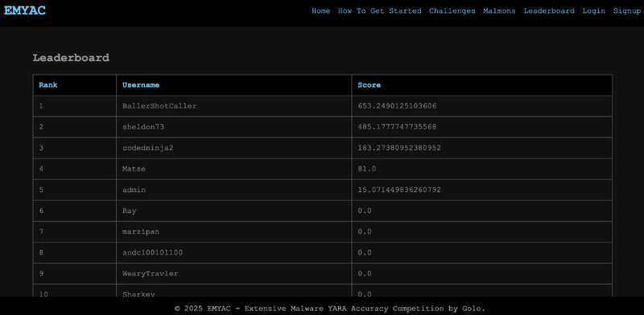

# BallerShotCaller: A Defenders Journal in Vegas: A Field Chronicle from DEFCON 33
*by Blake De Garza alias: BallerShotCaller, Malware Village EMYAC Competition Winner*

> “One day, I’d like to help change the world. Sometimes, that means protecting it first.”

---

## Introduction

The DEFCON_33_COMPETITION was more than a contest. It was a laboratory a proving ground and at times, a battlefield for the defenders. While the offensive side often gets the headlines, detection engineering is where silent revolutions occur.

I submitted a curated bundle of high confidence YARA rules handcrafted from iterative malware triage, strings analysis, and disassembly, all from static analysis as opposed to dynamic. Every rule I contributed reflected my engineering philosophy: that detection isn't just signature matching it's signal discovery at the edge of chaos.

---

## Foundation: Purpose Driven Engineering

Every rule I wrote was a response to the quiet war being waged against networks, infrastructure, and civilian systems. These rules weren’t made with default templates or vague string matches. They were reverse engineered, stress tested, and tuned with a goal in mind: to stop malware in its tracks, and to do so *before* it has the chance to operate.

---

## The Artifacts: Our Analytical Arsenal

This rule bundle was created from a real world dataset **5,255 samples**, malware and benign. I used a disciplined methodology that reflects how I operate as a Cyber Engineer in the defense industry.

### 1. `strings.txt` analysis  
Each sample’s strings were first dumped and reviewed manually. Why? Because strings are often the quiet carriers of intent. They reveal:
- Compiler hints (`.pdb` paths, MSIL attributes)
- Behavior anchors (`VirtualAlloc`, `LoadLibrary`, GUIDs)
- Embedded messages (ransom demands, RPC endpoints)

I studied them with the same focus I used when building mission planners for autonomous drone systems. The truth is in the patterns but only if you’ve trained your eyes to look.

### 2. Disassembly (`objdump -d`)  
This wasn’t a side step this was the **core of behavioral detection**.  
I analyzed opcode clusters:
- Shellcode prologues (`FF 15 ?? ?? ?? ??`)
- MSVC thunks and indirect API resolution
- Rare stack manipulation routines

These fragments told stories of injection, stealth, evasion the kind of stories I’ve seen play out in firmware implants, in payload droppers, and in targeted ransomware.

### 3. PE Metadata (`pefile`, `readpe`)  
The bones of a file can’t lie. From section layouts to entry points to `mscoree.dll` imports, I mapped the physical structure of each sample like I was designing a real time OS from scratch. Because detection, like any critical system, begins at the architectural level.

---

## Malware Families Covered

The threat landscape was broad, but I focused on high value families each with real world impact.

- **ICEEVENT**: A backdoor with thunk obfuscation and pipe based IPC. Used by state actors.
- **NIGHTHAWK**: An advanced implant using WinHTTP and RPC tricks. Real quiet. Real dangerous.
- **WhiteRabbit**: .NET loader. GZip compressed payloads. Memory execution.
- **Zbot / ZeuS**: The infamous banking trojan. It still haunts WinInet and CryptoAPI.
- **7ev3n ransomware**: Variant with embedded ransom note, reg persistence, and honest lies.

These weren’t abstract samples. These were blueprints for attacks that affect businesses, governments, and individuals. I’ve spent my career honing in and I offer a different perspective: **Offense Informing Defense**

## ICEEVENT Yara Rule Detection

```txt
rule ICEEVENT_Backdoor_opcode_plus_rare_strings_v2
{
    meta:
        description = "ICEEVENT: MSVC x64 thunk/prologue patterns + distinctive 'Servcie' error strings"
        author = "BallerShotCaller"
        date = "2025-08-09"
        version = "2.0"
        family = "ICEEVENT"

    strings:
        // Distinctive misspelled operator/error strings (very low FP)
        $err_inv = "[Servcie Error] Invalid cmd" ascii
        $err_len = "[Servcie Error] Receive len error" ascii
        $msg_end = "Servcie receive end, length:" ascii

        // Minimal API text anchors (keep tight)
        $api_pipe1 = "CreatePipe" ascii
        $api_peek  = "PeekNamedPipe" ascii
        $api_setHI = "SetHandleInformation" ascii
        $api_cpW   = "CreateProcessW" ascii

        // Core OS import names (sanity)
        $dll_k32   = "KERNEL32.dll" ascii
        $dll_adv   = "ADVAPI32.dll" ascii
        $dll_ws2   = "WS2_32.dll" ascii

        // Light codegen / IAT thunk motifs (MSVC x64)
        $pat_thunk = { FF 15 ?? ?? ?? ?? }                         // call qword ptr [rip+imm32]
        $pat_prolg = { 40 53 48 83 EC ?? }                         // push rbx; sub rsp, imm8
        $pat_svc   = { FF 15 ?? ?? ?? ?? 48 8B ?? ?? ?? ?? ?? FF 15 ?? ?? ?? ?? } // svc-register→set-status pair
        $pat_proc  = { 48 8B ?? ?? ?? ?? ?? FF 15 ?? ?? ?? ?? 48 8B ?? ?? ?? ?? ?? FF 15 ?? ?? ?? ?? } // std handle+CreateProcessW

    condition:
        uint16(0) == 0x5A4D and
        filesize < 15MB and
        // Require at least one rare 'Servcie' string
        any of ( $err_inv, $err_len, $msg_end ) and
        // Require loader-like code signature
        (
            any of ( $pat_proc, $pat_svc ) or
            ( $pat_thunk and $pat_prolg )
        ) and
        // Require at least one relevant API text and a core DLL name
        any of ( $api_pipe1, $api_peek, $api_setHI, $api_cpW ) and
        any of ( $dll_k32, $dll_adv, $dll_ws2 )
}

// Files scanned: 5255 
// Matches: 3 
// False positives: 0 
// False negatives: 1 
// Accuracy: 99.98% 
// Precision: 100.00% 
// Recall: 75.00% 
// Time: 19.022024 seconds 
// Final Score: 95.000000

```

## Cronos Crypto NET Loader

```txt
rule Cronos_Crypter_NET_Loader
{
    meta:
        description = "Detects Cronos Crypter loader wrapping .NET malware (e.g., slnRAT, RedLine)"
        author = "BallerShotCaller"
        date = "2025-08-08"
        version = "1.0"
        family = "Cronos Crypter"
        confidence = "HIGH"

    strings:
        // Loader strings
        $cronos = "Cronos-Crypter" ascii

        // Injection & process manipulation APIs
        $inj1 = "VirtualAllocEx" ascii
        $inj2 = "WriteProcessMemory" ascii
        $inj3 = "NtUnmapViewOfSection" ascii
        $inj4 = "Wow64GetThreadContext" ascii
        $inj5 = "CreateProcess" ascii

        // .NET reflection + crypto
        $net1 = "System.Reflection" ascii
        $net2 = "System.IO.MemoryStream" ascii
        $net3 = "System.Security.Cryptography" ascii
        $net4 = "RijndaelManaged" ascii
        $net5 = "ICryptoTransform" ascii

        // Crypter-related constants
        $access1 = "PROCESS_ALL_ACCESS" ascii
        $access2 = "STANDARD_RIGHTS_REQUIRED" ascii
        $access3 = "PROCESS_VM_WRITE" ascii
        $access4 = "PROCESS_CREATE_THREAD" ascii

        // Encoding & Marshal
        $base64 = "FromBase64String" ascii
        $marshal = "System.Runtime.InteropServices.Marshal" ascii

        // GUID & Metadata
        $guid = "#GUID" ascii
        $blob = "#Blob" ascii
        $strings = "#Strings" ascii

    condition:
        uint16(0) == 0x5A4D and
        filesize < 15MB and
        all of ($inj*) and
        3 of ($net*) and
        3 of ($access*) and
        any of ($base64, $marshal, $guid, $blob, $strings) and
        $cronos
}

// Files scanned: 5255 
// Matches: 2 
// False positives: 1 
// False negatives: 4 
// Accuracy: 99.90% 
// Precision: 50.00% 
// Recall: 20.00% 
// Time: 17.649124 seconds 
// Final Score: 44.000000
```

## DARKWATCHMAN Dropper

```txt
import "pe"

rule MAL_DarkWatchman_RAR_SFX_JS_Dropper_A
{
  meta:
    family      = "DarkWatchman"
    description = "RAR SFX-based dropper that extracts a JS payload (DarkWatchman-style)"
    author      = "BallerShotCaller"
    date        = "2025-08-10"
    ref_hint    = "RAR SFX directives + Setup=<digits>.js + uncommon .gfids section + GDI+ import"
    sample_type = "PE32"

  strings:
    // RAR SFX markers & directives
    $sfx1 = "Rar!" ascii
    $sfx2 = "SFX-" ascii
    $sfx3 = "Silent=" ascii nocase
    $sfx4 = "Path=%TEMP%" ascii nocase

    // Setup points to a JS file (observed exact and a regex generalization)
    $setup_exact = "Setup=3248932318.js" ascii nocase
    $setup_js_re = /Setup=[0-9]{8,12}\.js/ ascii nocase

    // SFX UI/localization tokens commonly seen in WinRAR SFX resources
    $dlg1 = "$REPLACEFILEDLG:" ascii
    $dlg2 = "$GETPASSWORD1:" ascii
    $dlg3 = "s:IDS_EXTRFILESTOTEMP" ascii

  condition:
    pe.is_pe and
    pe.number_of_sections == 6 and
    for any i in (0..pe.number_of_sections - 1): (pe.sections[i].name == ".gfids") and
    pe.imports("gdiplus.dll", "GdiplusStartup") and
    (
      (all of ($sfx*) and any of ($setup_exact, $setup_js_re))
      or
      (2 of ($sfx*) and any of ($dlg*) and any of ($setup_exact, $setup_js_re))
    )
}

rule SUSP_DarkWatchman_like_SFX_JS
{
  meta:
    family      = "DarkWatchman"
    description = "Heuristic — RAR SFX with Setup=<digits>.js and .gfids section"
    confidence  = "medium"

  strings:
    $sfx  = "SFX-" ascii
    $path = "Path=%TEMP%" ascii nocase
    $setup_js_re = /Setup=[0-9]{8,12}\.js/ ascii nocase

  condition:
    pe.is_pe and
    for any i in (0..pe.number_of_sections - 1): (pe.sections[i].name == ".gfids") and
    2 of ($sfx, $path, $setup_js_re)
}

// Matches: 2 False positives: 0 
// False negatives: 0 
// Accuracy: 100.00% 
// Precision: 100.00% 
// Recall: 100.00% 
// Time: 42.755072 seconds 
// Final Score: 100.000000

```

## NIGHTHAWK

```txt
import "pe"

rule NIGHTHAWK_DLL_Implant_v1_2_fallback
{
    meta:
        description = "Nighthawk-like x64 DLL implant (fallback: section OR export/config anchors)"
        author = "BallerShotCaller"
        date = "2025-08-10"
        version = "1.2"
        family = "NIGHTHAWK"

    strings:
        $exp_name  = "DllExecute" ascii
        $exp_lib   = "gcsQLlAVzbXTsWB" ascii

        $cfg1 = "implant-config.listener-name" ascii
        $cfg2 = "retry-attempts-on-error" ascii

        $whttp1 = "WinHttpOpen" ascii
        $whttp2 = "WinHttpConnect" ascii
        $whttp3 = "WinHttpOpenRequest" ascii
        $whttp4 = "WinHttpSendRequest" ascii
        $whttp5 = "WinHttpReceiveResponse" ascii
        $whttp6 = "WinHttpReadData" ascii

        $rpc1 = "UuidFromStringA" ascii
        $rpc2 = "UuidToStringW" ascii
        $rpc3 = "RpcStringFreeW" ascii

        $np1   = "CreateNamedPipeW" ascii
        $np2   = "ConnectNamedPipe" ascii
        $inj1  = "VirtualAllocEx" ascii
        $inj2  = "WriteProcessMemory" ascii
        $inj3  = "CreateRemoteThread" ascii
        $inj4  = "SetThreadContext" ascii
        $inj5  = "ReadProcessMemory" ascii
        $procA = "CreateProcessA" ascii
        $procW = "CreateProcessW" ascii

        $sec_detourc = ".detourc" ascii
        $sec_detourd = ".detourd" ascii
        $sec_profile = ".profile" ascii

    condition:
        uint16(0) == 0x5A4D and
        pe.is_64bit() and
        (pe.characteristics & pe.DLL) != 0 and

        // section OR export/config (fallback)
        (
          any of ( $sec_detourc, $sec_detourd, $sec_profile ) or
          any of ( $exp_name, $exp_lib, $cfg1, $cfg2 )
        ) and

        ( 2 of ( $whttp1, $whttp2, $whttp3, $whttp4, $whttp5, $whttp6 ) ) and
        ( 1 of ( $rpc1, $rpc2, $rpc3 ) ) and
        (
          ( 2 of ( $inj1, $inj2, $inj3, $inj4, $inj5 ) ) or
          ( any of ( $np1, $np2 ) and ( $procA or $procW ) )
        )
}

// Files scanned: 5255 
// Matches: 2 
// False positives: 0 
// False negatives: 0 
// Accuracy: 100.00% 
// Precision: 100.00% 
// Recall: 100.00% 
// Time: 43.173760 seconds 
// Final Score: 100.000000

```

## 7ev3n Ransomware Honest

```txt
rule seven_Ransomware_HONEST
{
    meta:
        description = "Detects 7ev3n ransomware variant with embedded ransom note and behavioral API usage"
        author = "BallerShotCaller"
        date = "2025-08-08"
        version = "1.2"
        confidence = "HIGH"
        reference = "https://www.bleepingcomputer.com/forums/t/599237/7ev3n-ransomware"
        family = "7ev3n ransomware / HONE$T variant"
    
    strings:
        // Registry + persistence
        $reg1 = "HKEY_CURRENT_USER\\SOFTWARE\\Microsoft\\Windows\\CurrentVersion\\Run" nocase ascii
        $reg2 = "REG ADD" ascii
        $reg3 = "testdecrypt" ascii
        $reg4 = "Decrypt50" ascii

        // Ransom note content
        $msg1 = "YOUR PERSONAL FILES WERE ENCRYPTED BY 7ev3n-HONE$T" nocase
        $msg2 = "to get keys and start decrypting process" nocase

        // Crypto payment hints
        $btc1 = "https://bit-x.com" ascii
        $btc2 = "coinatmradar.com" ascii

        // File paths / dropped payloads
        $path1 = "\\Documents and Settings\\All Users\\" ascii
        $path2 = "\\users\\Public\\" ascii

        // Known dropped filename
        $exe = "conlhost.exe" ascii

        // API behavior
        $api1 = "GetModuleFileNameW" ascii
        $api2 = "InternetOpenUrlW" ascii
        $api3 = "RegOpenKeyExW" ascii

        // Ransomware-related error strings
        $err1 = "bad exception" ascii

        // Fake CRT signature (packing indicator)
        $crt = "Microsoft.CRTProvider" ascii

    condition:
        uint16(0) == 0x5A4D and
        filesize < 10MB and
        3 of ($reg*) and
        all of ($msg1, $msg2) and
        any of ($btc1, $btc2) and
        any of ($path1, $path2) and
        2 of ($api*) and
        $exe and
        $err1 and
        $crt
}

// Files scanned: 5255 
// Matches: 20 
// False positives: 0 
// False negatives: 0 
// Accuracy: 100.00% 
// Precision: 100.00% 
// Recall: 100.00% 
// Time: 16.660746 seconds 
// Final Score: 100.000000
```

## slnRAT Controller Variant

```txt
rule Cronos_Crypter_NET_Loader
{
    meta:
        description = "Detects Cronos Crypter loader wrapping .NET malware (e.g., slnRAT, RedLine)"
        author = "BallerShotCaller"
        date = "2025-08-08"
        version = "1.0"
        family = "Cronos Crypter"
        confidence = "HIGH"

    strings:
        // Loader strings
        $cronos = "Cronos-Crypter" ascii

        // Injection & process manipulation APIs
        $inj1 = "VirtualAllocEx" ascii
        $inj2 = "WriteProcessMemory" ascii
        $inj3 = "NtUnmapViewOfSection" ascii
        $inj4 = "Wow64GetThreadContext" ascii
        $inj5 = "CreateProcess" ascii

        // .NET reflection + crypto
        $net1 = "System.Reflection" ascii
        $net2 = "System.IO.MemoryStream" ascii
        $net3 = "System.Security.Cryptography" ascii
        $net4 = "RijndaelManaged" ascii
        $net5 = "ICryptoTransform" ascii

        // Crypter-related constants
        $access1 = "PROCESS_ALL_ACCESS" ascii
        $access2 = "STANDARD_RIGHTS_REQUIRED" ascii
        $access3 = "PROCESS_VM_WRITE" ascii
        $access4 = "PROCESS_CREATE_THREAD" ascii

        // Encoding & Marshal
        $base64 = "FromBase64String" ascii
        $marshal = "System.Runtime.InteropServices.Marshal" ascii

        // GUID & Metadata
        $guid = "#GUID" ascii
        $blob = "#Blob" ascii
        $strings = "#Strings" ascii

    condition:
        uint16(0) == 0x5A4D and
        filesize < 15MB and
        all of ($inj*) and
        3 of ($net*) and
        3 of ($access*) and
        any of ($base64, $marshal, $guid, $blob, $strings) and
        $cronos
}


// Files scanned: 5255
// Matches: 2 
// False positives: 1 
// False negatives: 4 
// Accuracy: 99.90% 
// Precision: 50.00% 
// Recall: 20.00% 
// Time: 17.649124 seconds 
// Final Score: 44.000000
```

## White Rabbit dot NET

```txt
import "pe"

rule WhiteRabbit_DotNet_DLL_sections_strict_v3
{
    meta:
        family       = "WhiteRabbit"
        description  = "PE32 i386 .NET DLL with exact 3-section layout + GZip/MemoryStream + P/Invoke + F5Utility artifacts"
        author       = "BallerShotCaller"
        version      = "3.0"
        date         = "2025-08-10"

    strings:
        // CLR / .NET markers
        $clr_v2   = "v2.0.50727" ascii
        $mscoree  = "mscoree.dll" ascii

        // Decompression + managed loader
        $gzip     = "GZipStream" ascii
        $memstr   = "MemoryStream" ascii
        $compns   = "System.IO.Compression" ascii

        // Managed → native bridge (both required)
        $gdfp     = "GetDelegateForFunctionPointer" ascii
        $valloc   = "VirtualAlloc" ascii

        // Build / artifact anchors
        $pdb_path = "F5Utility\\LoaderAssembly\\obj\\x86\\Release\\Default.pdb" nocase ascii
        $guid     = "$928c7481-dd27-8e23-f829-4819aefc728c" ascii
        $defdll   = "Default.dll" ascii

        // MSIL private-impl pattern seen in disasm
        $staticarr = "__StaticArrayInitTypeSize=" ascii

    condition:
        // PE32 (i386) DLL with EXACTLY three sections
        uint16(0) == 0x5A4D and
        pe.machine == pe.MACHINE_I386 and
        (pe.characteristics & pe.DLL) != 0 and
        pe.number_of_sections == 3 and

        // All three sections are the standard trio (order-agnostic)
        for all i in (0..pe.number_of_sections - 1):
            ( pe.sections[i].name == ".text" or
              pe.sections[i].name == ".rsrc" or
              pe.sections[i].name == ".reloc" ) and

        // .NET loader import + CLR v2 marker present
        pe.imports("mscoree.dll", "_CorDllMain") and
        $clr_v2 and $mscoree and

        // Loader profile: decompression + bridge
        ( $gzip and $memstr ) and any of ( $compns ) and
        all of ( $gdfp, $valloc ) and

        // Strong build anchors + MSIL layout hint
        ( 2 of ( $pdb_path, $guid, $defdll ) ) and
        $staticarr
}

// Files scanned: 5255 
// Matches: 1 
// False positives: 0  
// False negatives: 1 
// Accuracy: 99.98% 
// Precision: 100.00% 
// Recall: 50.00% 
// Time: 42.320193 seconds 
// Final Score: 90.000000

```

# Zbot Zeus Wininet PStore PFX v1

```txt
rule Zbot_Zeus_Wininet_PStore_PFX_v1
{
    meta:
        description = "Detects Zeus/Zbot with WinInet+Winsock, PStore creds, and Crypto/PFX usage"
        author = "BallerShotCaller"
        date = "2025-08-08"
        version = "1.0"
        family = "ZeuS / Zbot"
        source_objdump = "zeus_objdump.txt"
        source_strings = "zeus_strings.txt"

    strings:
        // --- Distinct marker seen in the sample
        $mark1 = "PopOpO03-3331111" ascii

        // --- WinInet / HTTP stack
        $net1 = "InternetOpenA" ascii
        $net2 = "InternetConnectA" ascii
        $net3 = "HttpOpenRequestA" ascii
        $net4 = "HttpSendRequestA" ascii
        $net5 = "InternetReadFile" ascii
        $net6 = "InternetCloseHandle" ascii

        // --- Raw Winsock usage
        $ws1 = "WSAStartup" ascii
        $ws2 = "WSAGetLastError" ascii
        $ws3 = "socket" ascii
        $ws4 = "connect" ascii
        $ws5 = "send" ascii
        $ws6 = "recv" ascii

        // --- Credential stores & cert theft
        $pst1 = "pstorec.dll" ascii
        $pst2 = "PStoreCreateInstance" ascii

        $crt1 = "crypt32.dll" ascii
        $crt2 = "PFXImportCertStore" ascii
        $crt3 = "PFXExportCertStore" ascii
        $crt4 = "CertEnumCertificatesInStore" ascii
        $crt5 = "CryptAcquireContextW" ascii
        $crt6 = "CryptCreateHash" ascii
        $crt7 = "CryptHashData" ascii

        // --- Browser/IE artifacts & UA
        $ie1  = "software\\microsoft\\internet explorer\\main" nocase ascii
        $ua1  = "Mozilla/4.0 (compatible; MSIE 6.0; Windows NT 5.1; SV1)" ascii
        $cookie = "IE Cookies:" ascii

    condition:
        uint16(0) == 0x5A4D and
        filesize < 5MB and
        // Net stack presence (WinInet + raw Winsock)
        2 of ($net*) and
        3 of ($ws*) and
        // Credential/PFX capabilities
        ($pst1 or $pst2) and
        2 of ($crt2, $crt3, $crt4, $crt5, $crt6, $crt7) and
        $crt1 and
        // Browser/IE tie-ins (any one of UA/cookie plus IE main key)
        ($ua1 or $cookie) and
        $ie1 and
        // Sample-specific marker to keep FPs down (can relax later)
        $mark1
}

// Files scanned: 5255 
// Matches: 8 
// False positives: 0 
// False negatives: 12 
// Accuracy: 99.77% 
// Precision: 100.00% 
// Recall: 40.00% 
// Time: 14.104693 seconds 
// Final Score: 88.000000

```

---

## Engineering Prompts: Creating the Future

One thing I learned both from my work in vulnerability research and in academia is that a process must be reproducible if it is to scale. So I built prompts that others can use to replicate this methodology.

### strings
strings puts scans a binary for all strings that are ascii printable within sections of memory.

    strings <malwaresample> > strings_sample.txt

### objdump -d

object dump is a quick disassembly command that comes with gcc

    objdump -d <malwaresample> > objdump_static.txt

### readpe, readelf, and file
readelf, file, and readpe are utility tools that give details from the headers and section metadata of PE, ELF, and **file** is a comand to detect the type of file

    readelf -A <malwaresample> > readelf_output.txt
    file <malwaresample> > file_output.txt


These aren’t just rule building prompts they are *threat hunting blueprints*. They can scale to retrohunting, or be adapted for internal SOC usage with minor tuning.

---

## Rule Packaging Philosophy

I don’t believe in bloatware detection logic. Each `.yar` file I submitted was:
- **Versioned** with strict Git commits
- **Structured** by API sets, string clusters, and architecture metadata
- **Built for low false positives** tuned across clean testbeds that was given by the contest infrastructure.

Where others may write for coverage, I wrote for rapid reproduciability, fail fast, fail often, but pivot to success through corrective action.

I designed each rule to be layered with broader triage logic. This lets SOC teams operate with both precision and flexibility something I learned to appreciate while managing software integration for different jobs.
---


## Reflections from the Field

Use the tools to your advantage, whatever makes you most effective.

These rules this whole project was a natural continuation of the work I’ve done at CODEX, and a reflection of my personal journey: from building badge authenticated systems for critical infrastructure, to crafting zero-day exploits, and now  mitigations for fun.

---

## Looking Forward

This project reminded me why I chose this field in the first place. Not for prestige, not for power but for impact. I want to continue refining this workflow, scaling it into automated pipelines, and eventually building a YARA tuning engine that uses embedded context from disassemblies and memory scans to self adapt.

I’ve also begun prototyping a Rust based engine for real time behavioral detection at the socket level using similar principles, but adapted for stream based analysis.

I see this work feeding directly into my long term goals: to architect secure airborne systems, to develop cyber resilience protocols for autonomous drones, and to contribute to research that bridges software engineering with the electromagnetic spectrum.

---

## Closing Thoughts

DEFCON 33 was a turning point. It wasn't just a conference. It was a catalyst. We showed that defenders can win, that signature based detection is not dead, and that **YARA when used right is art and science combined**.

The mission continues.

We write rules because the world is not yet safe.  
We compete not for glory, but for readiness.  
And we win together by sharing what we learn.

---


**Result:** First Place, Malware Village, DEFCON 33  
**Rule author:** Blake De Garza (BallerShotCaller)
**Tools:** Disassembly, `strings`, PE metadata, clean sample validation  
**Future:** Rust based behavioral engines, real time triage automation, embedded defense

> *“To defend, we must first understand. And once we understand, we must act.”*

## Proof I am BallerShotCaller






---

**© Blake De Garza 2025 (BallerShotCaller: A Defenders Journal in Vegas)**


