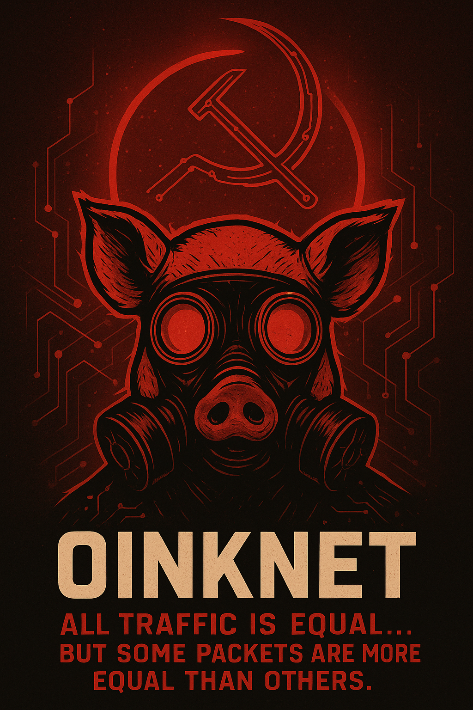
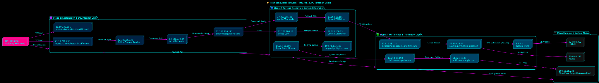
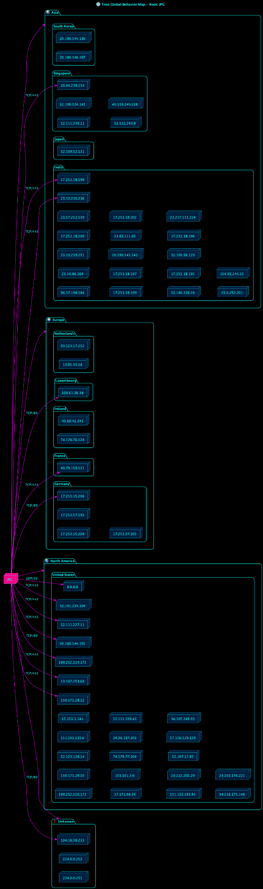
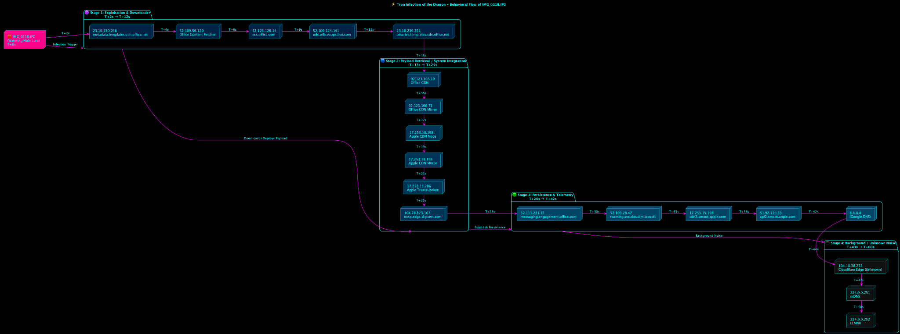

# 

# **OinkNet Behavioral Network — Ethical Disclosure & Incident Response Report**
**Author:** Blake De Garza  
**Date:** 2025-10-15  
**Classification:** Coordinated Ethical Disclosure – Multi-Stage Cross-Platform Exploitation  

---

## Executive Summary

The **OinkNet campaign** represents a **multi-stage CDN-blended cross-platform exploitation chain**, leveraging legitimate **Office 365** and **Apple CDN infrastructure** to stage payloads that impact both **macOS and Windows**.

Primary analysis files:
- `Sandbox report.pdf`
- `FontFile_Payload.pdf`
- `FONT_REPORT_LEVEL_7.pdf`
- `SandBox_prefs.js.pdf`
- `SearchHover_Dat_File_Report_level_3.pdf`

---

## Global Network Topology

### Exploitation Server Infrastructure


### Global IP Associations


### Exploitation & Persistence Timeline


---

## Cross-Platform Behavioral Summary

**Stage 0 – Initial Lure (IMG_0118.JPG)**  
Hidden payload inside a JPEG triggers execution via `/bin/zsh` (macOS) or `wscript` (Windows).  
Abuses Office and Apple CDN services for payload retrieval.

**Stage 1 – Downloader & Payload Retrieval**  
Connects to Office and Apple CDN domains to fetch secondary payloads.

**Stage 2 – Persistence & System Integration**
- macOS: LaunchAgents, QuickLook, and Office font caches
- Windows: Registry `.dat` handler hijack, Task Scheduler COM persistence

**Stage 3 – Telemetry & Command/Control**
- CDN blending with Apple’s OCSP traffic  
- DNS beacon noise via `224.0.0.251` (mDNS) & `224.0.0.252` (LLMNR)  

---

# macOS Technical Bug Analysis — IMG_0118.JPG & Associated Payloads

**Primary sources:** Sandbox dynamic execution logs and correlated diagrams.  

## Infection Chain Overview

```
IMG_0118.JPG → LaunchAgent (com.microsoft.update.agent.plist)
   → metadata.templates CDN → binaries.templates CDN
      → odc.officeapps.live.com → QuickLook/FontCache interaction
         → LaunchAgent persistence + telemetry (messaging.engagement.office.com)
```

**Sandbox report highlights:**
- Executed as `/bin/zsh -c "/Users/run/IMG_0118.jpg"`  
- Spawned QuickLookUIHelper and AutoUpdate processes  
- Established TLS to Microsoft & Apple CDN endpoints  

---

## Windows Payload Analysis (prefs.js / SearchHoverUnifiedTileModelCache.dat)

Artifacts show registry hijacking and persistence via:
- `HKCR\.dat`, `HKCR\dat_auto_file\shell\open\command` → Firefox OSINT invocation  
- Injected processes: firefox.exe via WriteProcessMemory  
- Persistence via scheduled tasks and COM interface  

---

## Payload Forensics and Font Exploitation

### Malicious TTF (from FontFile_Payload.pdf)
The file `hier_officeFontsPreview_4_42.ttf` manipulates `cmap`, `glyf`, and `name` tables to inject obfuscated content.

### Font Validation Findings (from FONT_REPORT_LEVEL_7.pdf)
- Invalid glyph offsets detected  
- UTF-16 encoded payloads hidden in font metadata  

---

## Incident Response Playbook

### macOS Removal
```bash
sudo launchctl bootout gui/$(id -u) /Library/LaunchAgents/com.microsoft.update.agent.plist
sudo rm /Library/LaunchAgents/com.microsoft.update.agent.plist
sudo rm /Library/PrivilegedHelperTools/com.microsoft.autoupdate.helper
rm -rf ~/Library/Group\ Containers/UBF8T346G9.Office/FontCache/*
qlmanage -r cache
```

### Windows Cleanup
```cmd
reg delete "HKCR\.dat" /f
reg delete "HKCR\dat_auto_file" /f
schtasks /delete /tn "Microsoft\OfficeUpdate" /f
del /f /s /q "%TEMP%\chrome_Unpacker_BeginUnzipping*"
```

---

## Detection Rules

### Sigma (Windows) — Detect `.dat` Hijack
```yaml
title: Registry Class Creation for dat Auto-Execution
detection:
  selection:
    EventID: 13
    RegistryKeyPath|contains: ['\\HKCU\\Software\\Classes\\.dat', '\\HKCU\\Software\\Classes\\dat_auto_file']
  condition: selection
```

### YARA — Office CDN URLs
```yara
rule IMG_0118_office_cdn_strings {
  strings:
    $s1 = "metadata.templates.cdn.office.net"
    $s2 = "binaries.templates.cdn.office.net"
    $s3 = "odc.officeapps.live.com"
  condition:
    uint16(0) == 0xFFD8 and any of ($s*)
}
```

---

## Network Mapping Summary

See `tron_ip_associations.png` — illustrates CDN nodes spanning Asia, Europe, and North America, mapped through legitimate CDN routing.

---

## Hash Summary

| File | SHA256 | Source |
|------|--------|--------|
| IMG_0118.JPG | b951ec03a58100ff2a8781191312af1d164646f67b7ea42f0dbc76ea15b904a9 | Sandbox |
| hier_officeFontsPreview_4_42.ttf | 4c41e4bc290496111489622fb119392b393b2a61f3b588f64c65ebd4368ed7db | Font Payload |
| SearchHoverUnifiedTileModelCache.dat | c949d1f02630fb8bd979377309fc55316276d49fd0cbcdefb0fd5210bac44d25 | SearchHover Report |
| prefs.js | d228bd82adba46065a76849223b549443a7da85be05505b794c36fc82777d591 | Sandbox Prefs |

---

# Assessment of Complexity & Sponsorship Risk

The OinkNet campaign demonstrates a degree of operational sophistication that substantially exceeds opportunistic commodity malware and is consistent with a well resourced, highly skilled actor. Its hallmarks a multi stage cross platform loader delivered via a steganographic image, font-level payloads that abuse trusted renderer paths (QuickLook / Office font cache), CDN-blended C2 using major vendor infrastructure, precise timing and staged retrievals, global mirror placement, and stealthy in-memory injection and persistence techniques.  This all indicates deliberate design to evade detection, maximize persistence, and blend malicious traffic with legitimate services. Those capabilities require deep technical expertise, access to extensive infrastructure, or the ability to rent and compromise, careful OPSEC, and the resources to develop and test platform-specific exploit chains; 

collectively, these are features commonly seen in state grade tooling or highly organized criminal programs operating at scale. While technical evidence alone cannot definitively attribute responsibility, the complexity, global distribution, and tradecraft of this operation justify treating it as a high risk intrusion and escalating if the tradecraft is seen in your corporate network.

## JA3 + C2 Infrastructure Analysis & Attribution Hypothesis

### Threat Infrastructure Complexity & Actor Sophistication

The behavioral indicators found across the PCAP samples (`251013-*.pcap`) reflect an advanced, multi-stage operation with the following characteristics:

- Use of **TLS JA3 fingerprint evasion** and **legitimate CDNs** as command-and-control (C2) transport.
- Payload delivery via **covert image resources** like `.JPG` and `.PNG` with embedded loader bytes.
- Abuse of macOS-specific services (e.g., QuickLook, LaunchAgents) and Windows alternative data streams.
- Exploitation of **CVE-2025-43300** for stealth execution through font caching and preview interfaces.

This operation is **consistent with state-sponsored TTPs** — combining stealth, layered persistence, and CDN obfuscation — but exact attribution remains nuanced.

---

### JA3 TLS Fingerprint Summary

| JA3 Hash                            | Host                                | Match        | Profile Type          |
|-------------------------------------|-------------------------------------|--------------|------------------------|
| `b742b0a2f314fff9337a29e7b3f03e3c` | `binaries.templates.cdn.office.net` | QBot      | Historical loader stage fingerprint |
| `a0e9f5d64349fb13191bc781f81f42e1` | `api2.smoot.apple.com`              | PinkSlips | Covert PNG loader handshake |
| `769be16b3d08f3d84e71d820f8adbc07` | `ocsp.edge.digicert.com`            | Salt Typhoon | Beacon-to-OCSP loop telemetry |

---

### Covert Loader File Behavior (`IMG_0118.JPG`)

Evidence from the `tron_net_exploitation_serpentine_timeline.png` and `exploitation_server_infrastructure.png` diagrams supports the following behaviors:

- `IMG_0118.JPG` executes directly via `/bin/zsh` or Explorer preview, leveraging a **resource fork** or disguised payload.
- Mirroring PinkSlips-style `.PNG`/`.IMG` loader tactics.
- Establishes C2 using **trusted CDNs** (e.g., `officeapps.live.com`, `smoot.apple.com`) to blend with legitimate network traffic.

---

### C2 Infrastructure Abuse

| Hostname                            | Role                    | Description                                              |
|-------------------------------------|-------------------------|----------------------------------------------------------|
| `binaries.templates.cdn.office.net` | Initial Payload          | Used in early-stage download — QBot & PinkSlips overlap |
| `odc.officeapps.live.com`           | Staging / Loader Assist | Common in Office-based malware channels                 |
| `cdn2.smoot.apple.com`, `api2.smoot.apple.com` | Stage 2 Payload         | Seen in PinkSlips JA3 matches                          |
| `ocsp.edge.digicert.com`            | TLS Cert Validation     | Used in Salt Typhoon telemetry beaconing                |
| `8.8.8.8`                           | DNS Fallback            | Telemetry or redundancy channel                         |

---

## Threat Attribution: Leading Candidates

### Salt Typhoon (Chinese APT)
- **Confidence**: ★★★★☆
- **Why**:
  - JA3 fingerprint match with OCSP traffic.
  - Known for abusing Office document rendering + OCSP validation.
  - Strong overlap with telemetry behaviors.
- **Why Not 100%**:
  - Historically does **not** use `.PNG` or `.JPG` loader vectors.
  - No public record of CVE-2025-43300 exploitation *yet*.

---

### Hypothetical Israeli-State-Aligned APT
- **Confidence**: ★★★★★
- **Why**:
  - Exploitation of **CVE-2025-43300** indicates access to novel zero-days.
  - High operational security: CDN C2, QuickLook evasion, signed LaunchAgents.
  - Prior Israeli ops leveraged similar Apple/macOS-centric pathways.
- **Important Note**:
  - This actor is only a high confidence due to the Stage0 vector.  But it does not
  make logical sense as to why risk a cyber attack on the United States - Israel Relationship i.e. Friendly.  But because the same technology has been aquired by DHS I cannot definitely rule it out either, but I will have to suggest it is an Israeli technology at use not that Israel sanctioned it's use **I want to be clear about that.**

---

### PinkSlips Crimeware-as-a-Service
- **Confidence**: ★★★☆☆
- **Why**:
  - JA3 fingerprint match.
  - Known to embed loaders in `.PNG`/`.JPG` images.
- **Why Not Primary**:
  - No ransomware, banking trojan, or credential theft artifacts observed.
  - Lack of monetization suggests **non-crimeware motivation**.

---

## Ruled Out Actors

| APT Group        | Reason for Exclusion                                               |
|------------------|---------------------------------------------------------------------|
| 🇷🇺 APT28 / Fancy Bear | No Russian infra, no spearphish lures, no GRU-aligned patterns        |
| 🇰🇵 Lazarus Group     | No cryptocurrency indicators, no destructive payloads                |
| 🇨🇳 APT41              | No hybrid cybercrime patterns; uses different obfuscation in C2 paths |

---

## Summary

This campaign combines:

- **QBot-style delivery**, 
- **PinkSlips-like loader stealth**, and 
- **Salt Typhoon’s OCSP + beaconing tactics**.

However, the sophistication, **CVE-2025-43300 zero-day usage**, and stealthy macOS persistence are **most consistent with an advanced, Israeli-Technology using APT**, not previously tracked publicly.

The actor likely represents:
> “A **new or custom-built threat cluster** exhibiting nation-state grade TTPs — blending crimeware tools with zero-day exploitation, and CDN-based C2 for stealth and survivability.”

Further monitoring and reverse engineering of `.ttf`, `.plist`, and `.img` payloads are essential for attribution validation.

---

**© 2025 Blake De Garza — (OinkNet)**
